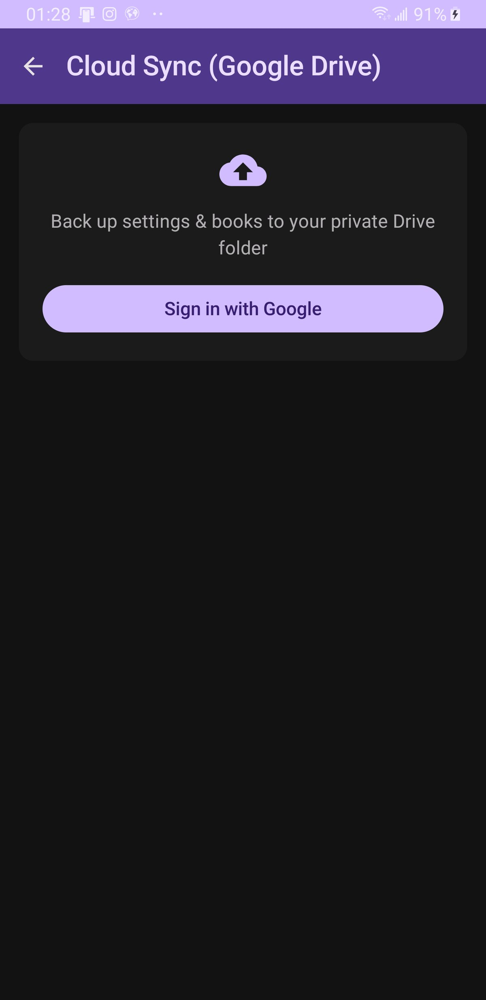
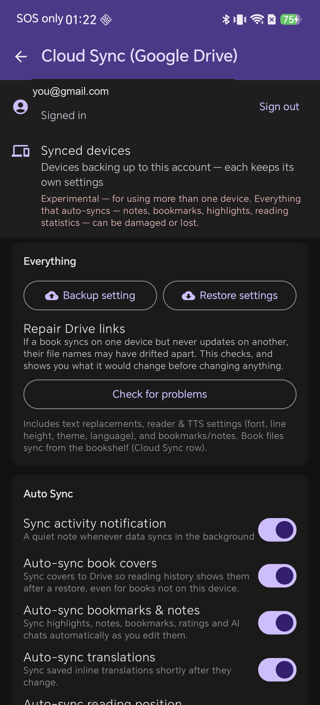
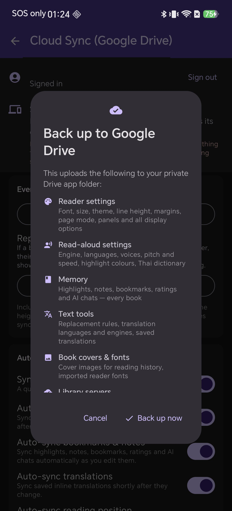
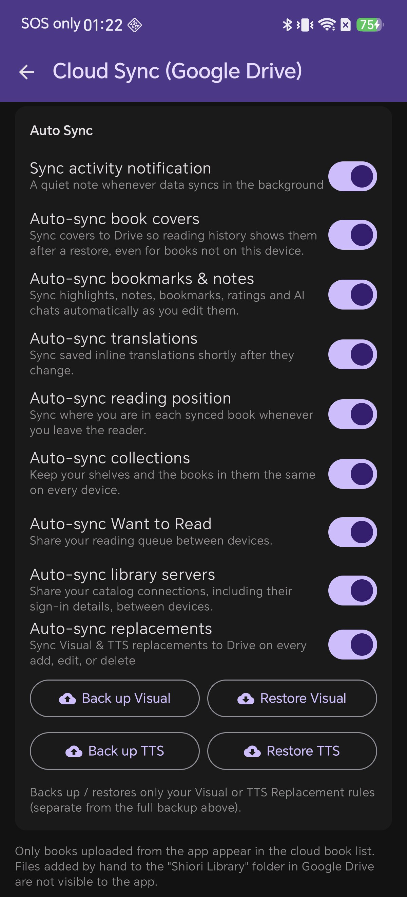
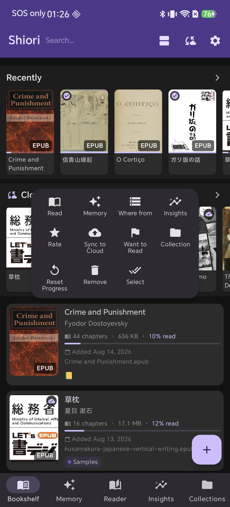
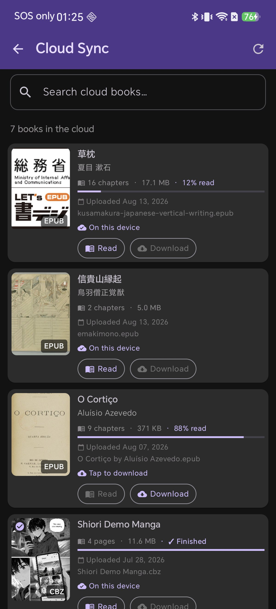
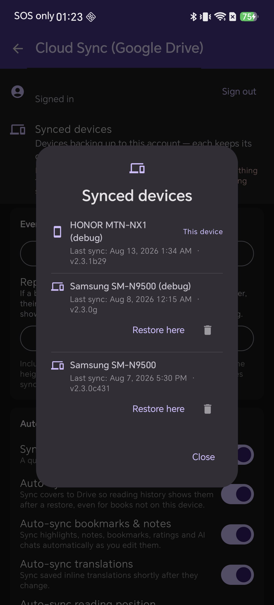
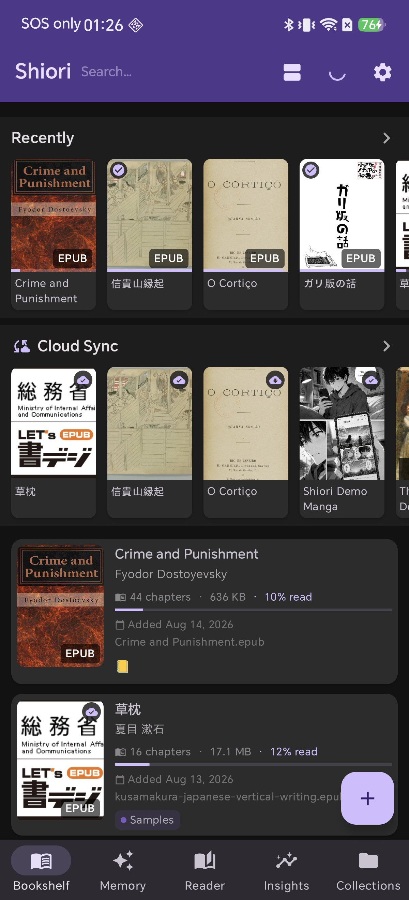
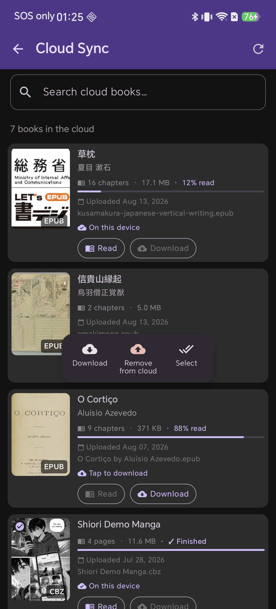

# Your Library, on Every Device — Cloud Sync with Google Drive, End to End

You highlight a paragraph on the train, rate a book before bed, and get halfway through chapter nine on your tablet. Then the phone dies, or a new one arrives, and every one of those small acts of reading is gone. **Cloud Sync** is Shiori's answer: your books, your place in them, your highlights, notes, ratings and reading statistics, all kept in *your own* Google Drive.

Not on our server. Shiori has no server. This guide walks through every part of it — signing in, what each switch actually moves, how book files differ from everything else, what happens on a second device, and which rule wins when two devices disagree.

> **The one-sentence version:** sign in with Google, leave Auto Sync on, and tap *Sync to Cloud* on the books you want stored. Everything else in this article is detail you can come back for.

---

## Where Your Data Actually Goes

Shiori asks for exactly two Google Drive permissions — `drive.file` and `drive.appdata` — and neither one can read the rest of your Drive. Shiori sees the files it created, and nothing else. Those files land in two different places, and knowing which is which explains most of the app's behaviour.

| Location | What lives there | Can you see it in Drive? |
| --- | --- | --- |
| **Shiori Library** | Your actual book files — EPUB, KEPUB, CBZ, PDF, FB2 | Yes — an ordinary folder you can open, browse and back up yourself |
| **Hidden app folder** | Settings, bookmarks, highlights, notes, ratings, reading statistics, covers, AI chats, saved translations, imported fonts, your Thai TTS dictionary | No — Drive's private per-app storage, invisible in the Drive UI |

Both count against your Google account's storage quota, and the book files are the only part big enough to notice.

> **Worth knowing before you start:** only books *uploaded from the app* appear in Shiori's cloud list. If you drop an EPUB into the "Shiori Library" folder by hand from a computer, the app will not see it — `drive.file` deliberately does not grant access to files the app did not create.

## What You Will Need

- **A Google account** — the same one on every device you want to keep in step.
- **Free Drive space** — enough for the books you choose to upload. Settings and highlights are tiny.
- **A network connection** — Wi-Fi for the first upload of a large library.

---

## Step-by-Step Guide (7 Steps)

### Step 1: Sign In With Google

Open **Settings → Cloud Sync (Google Drive)**. Before you sign in, the page is a single card: one button, and a line telling you what it is for. Tap **Sign in with Google** and pick your account. There is no Shiori account, no password, and nothing to create.

### Step 2: Meet the Cloud Sync Page

Once signed in the page grows into four parts: your **account** (with a real Sign out button), **Synced devices**, the **Everything** card (manual backup/restore plus a repair tool), and **Auto Sync**. The red line under Synced devices is not decoration — multi-device sync is marked experimental, and the warning sits where the decision is made.

### Step 3: Back Up Everything, Once

Tap **Backup setting**. Nothing uploads yet — first you get an inventory of exactly what is about to travel: reader settings, read-aloud settings, Memory (highlights, notes, bookmarks, ratings, AI chats), text tools, covers and fonts, and library servers. It is equally clear about what is *not* included: book files, reading statistics (they sync on their own) and supporter status.

**Restore settings** opens the same dialog in reverse — worth reading, because a restore overwrites what is on this device.

### Step 4: Set Auto Sync and Forget It

| Switch | What it keeps in step |
| --- | --- |
| Sync activity notification | A quiet note whenever something syncs in the background |
| Auto-sync book covers | Cover images, so reading history still looks like a bookshelf after a restore |
| Auto-sync bookmarks & notes | Highlights, notes, bookmarks, ratings and AI chats, as you edit them |
| Auto-sync translations | Saved inline translations |
| Auto-sync reading position | Where you are in each synced book, written when you leave the reader |
| Auto-sync collections | Your shelves and the books in them |
| Auto-sync Want to Read | Your reading queue |
| Auto-sync library servers | OPDS, Calibre, Komga, Kavita, WebDAV, S3 and FTP connections, including sign-in details |
| Auto-sync replacements | Visual and TTS replacement rules, on every add, edit or delete |

Switching one off never makes that data unbackupable — only un-automatic, since the manual backup always includes everything. Below the switches, four buttons back up or restore **only** your Visual or TTS replacement rules.

### Step 5: Send Book Files to the Cloud

Book files are deliberately **not** automatic — Shiori never quietly uploads a 600 MB comic archive over mobile data. Long-press any book and tap **Sync to Cloud**. The upload runs as a background service with a progress notification. Synced books wear a cloud badge, and a **Cloud Sync** row appears on the bookshelf.

Anything opened in **Incognito** never syncs — not the file, not the position, not a highlight.

### Step 6: Browse What Is in the Cloud

The cloud list shows each book's chapter count, size, reading progress, upload date and file name, plus an *On this device* badge. You can **Read**, **Download**, search by title, or long-press for **Remove from cloud**, **Remove from device** and multi-select. Downloading restores bookmarks, highlights and your reading position with the file.

### Step 7: Add a Second Device

Sign in to the same Google account. Content that syncs both ways arrives on its own; then open **Synced devices** to see every device with its model, app version and last sync time.

**Settings are kept per device** on purpose — two devices sharing one settings file used to overwrite each other on every push, and a phone and a tablet rarely want the same font size. When you *do* want them identical, tap **Restore here**.

---

## Which Way Does Each Thing Travel?

| Data | Up | Down | Who wins a conflict |
| --- | --- | --- | --- |
| Reading position & finished mark | Auto | Auto | The most recently read device |
| Bookmarks, highlights, notes | Auto | Auto | Everything is kept; deletions are remembered as deletions |
| Book ratings | Auto | Auto | Newest wins — unless both changed, and then Shiori asks you |
| Reading & listening statistics | Auto | Auto | Merged — no session is ever dropped |
| AI chats | Auto | Auto | Newest edit wins; deletes propagate |
| Saved translations | Auto | Auto | Merged; a delete stays local |
| Book covers | Auto | Auto | Identical files are skipped |
| Collections & Want to Read | Auto | Auto | Matched by shelf *name*, so two "Sci-Fi" shelves become one |
| Library servers | Auto | Auto | Merged per connection |
| Replacement rules | Auto | Review sheet | You approve incoming rules before they land |
| Reader & TTS settings | Auto | Manual | Per device by design — use *Restore here* |
| Imported fonts, Thai dictionary | Auto | Manual | Added, never deleted from Drive |
| Book files | Per book | Per book | You decide, from the shelf and the cloud list |
| Incognito books | Never | Never | — |

## The Sync Now Button

The cloud icon in the bookshelf's top bar is a full round trip, not just an upload: it pushes this device's settings, then pulls down statistics, per-book facts, shelves and reading queue from the others.

## When Something Looks Wrong

- **"No settings found in Drive"** — nothing has been backed up to this account yet. Run *Backup setting* first.
- **A book syncs on one device but never updates on the other** — their file names have drifted apart. *Everything → Repair Drive links → Check for problems* looks without changing anything and shows every rename before you agree to it.
- **Books added to the Drive folder by hand are missing** — expected. Import them into the app and use *Sync to Cloud*.
- **You cancelled a sync** — some items may already have moved. Running it again finishes the job.
- **Signing out** — clears the account from this device only. Nothing in Drive is deleted.

## A Note on Privacy

There is no Shiori account, no Shiori server, and no analytics attached to any of this. Your books and highlights go from your phone to your Drive and back. Incognito books are excluded entirely, and if you ever want out, sign out and delete the "Shiori Library" folder.

## FAQ

**Does Shiori upload all my books automatically?** No — one at a time, when you choose *Sync to Cloud*. Everything smaller syncs automatically by default.

**Where are my files inside Google Drive?** Book files in the visible **Shiori Library** folder; everything else in Drive's hidden per-app folder.

**Can Shiori read the rest of my Google Drive?** No — `drive.file` and `drive.appdata` limit an app to files it created itself.

**Will my reading position follow me to another device?** Yes, for synced books with *Auto-sync reading position* on.

**Why do my two devices have different font sizes?** Reader and TTS settings are per device by design. Use **Synced devices → Restore here**.

**What happens when I sign out?** Only this device disconnects. The Drive backup stays.

**Are Incognito books synced?** Never.

**Is using two devices safe?** It works and is marked experimental — everything that auto-syncs is merged by rules. Use *Repair Drive links* if a book stops updating on one side.
