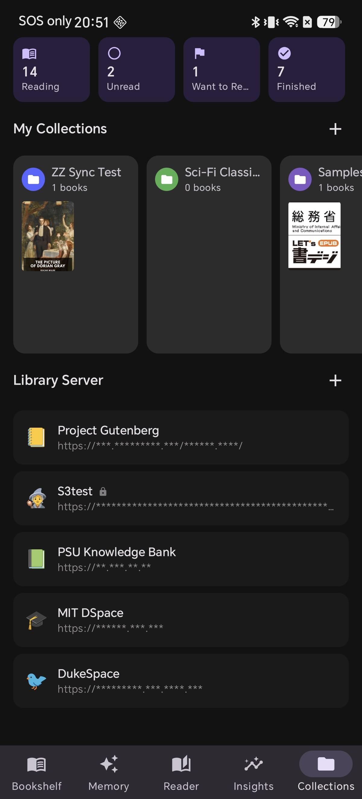
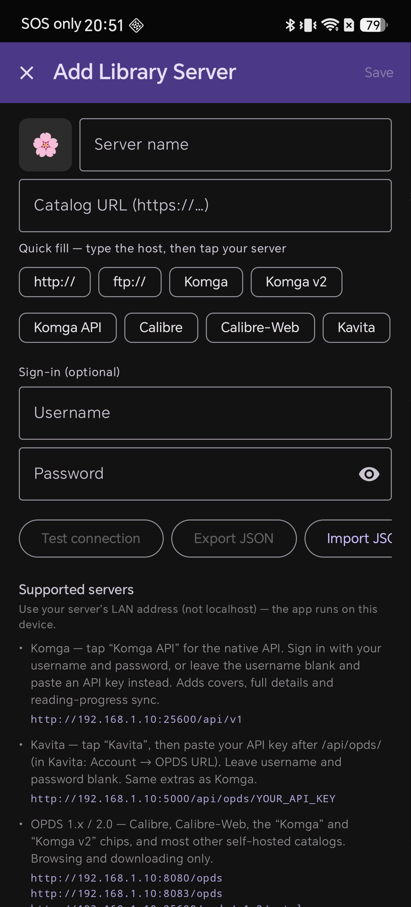
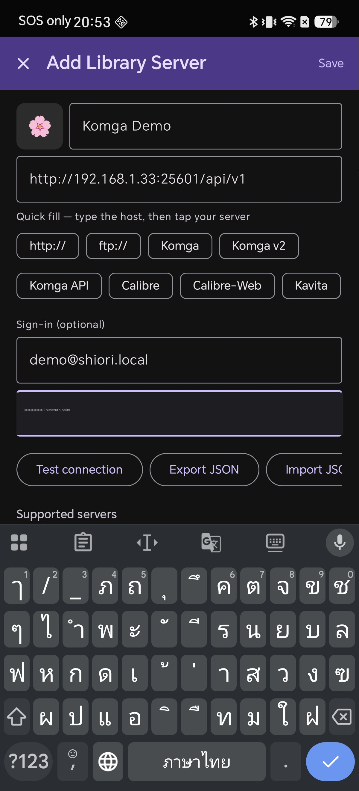
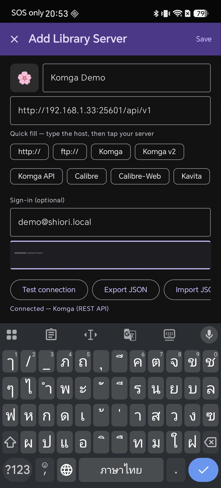
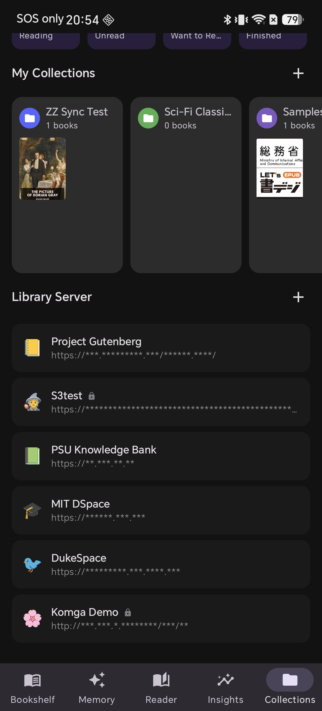
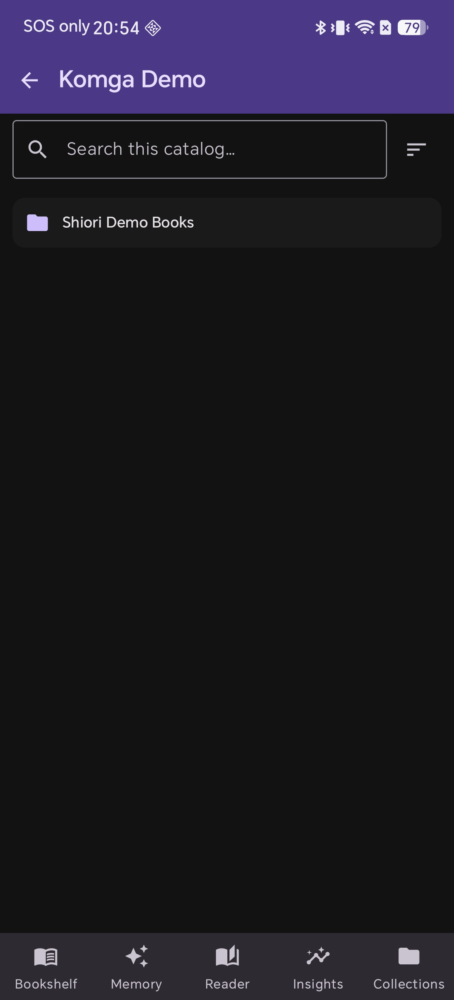
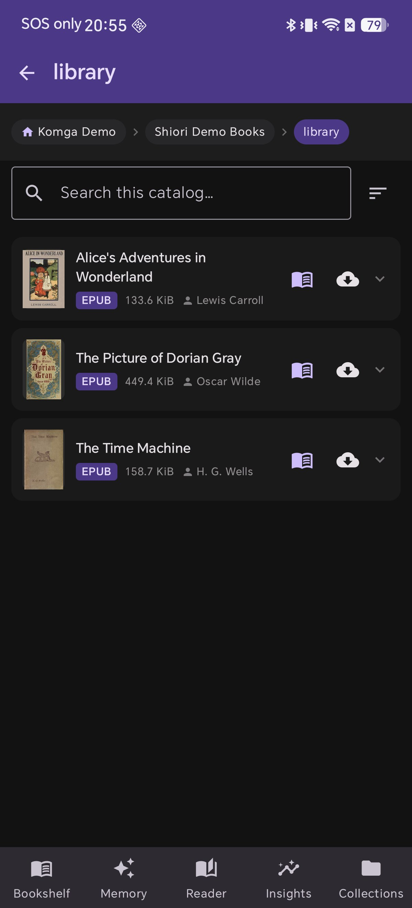

# Cómo conectar Komga a Shiori en Android (con portadas y sincronización de progreso)

Si tienes **Komga** en casa, toda tu biblioteca ya vive en tu propio servidor; sin embargo, leerla en el teléfono suele significar abrir una pestaña del navegador o usar una aplicación que solo muestra una lista básica de nombres de archivo sin portadas.

Shiori se conecta directamente a Komga. Si lo configuras de la forma correcta, obtendrás tus portadas, autores, la estructura de las series y la sincronización de tu posición de lectura con el servidor. Esta guía muestra los pasos exactos y, lo que es más importante, cuál de las tres opciones de Komga que ofrece Shiori deberías elegir.

## ¿Komga, OPDS o Komga API? Elige primero la opción correcta

Al añadir un servidor, Shiori ofrece varias opciones de autocompletado, y tres de ellas mencionan a Komga. No son equivalentes:

* **Komga** — se conecta mediante **OPDS v1**. Solo navegación y descargas.
* **Komga v2** — se conecta mediante **OPDS v2**. También solo navegación y descargas.
* **Komga API** — se conecta mediante la **REST API nativa** de Komga. Esta es la opción que añade **portadas, detalles completos de los libros y sincronización del progreso de lectura**.

OPDS es un estándar genérico de catálogos, por lo que funciona con casi cualquier servidor: Calibre, Calibre-Web, Standard Ebooks o Project Gutenberg. Esa universalidad es también su límite: solo transporta la información justa para listar y descargar un archivo.

La propia API de Komga gestiona series, metadatos y progreso de lectura, permitiendo que Shiori te muestre una biblioteca real en lugar de una lista de archivos y le comunique a Komga dónde dejaste de leer.

**Utiliza «Komga API» a menos que tengas un motivo concreto para no hacerlo.**

## Lo que necesitas

* Komga en funcionamiento y accesible en tu red
* Tu **nombre de usuario y contraseña** de Komga (o una clave API, si lo prefieres)
* La **dirección LAN** de tu servidor (no `localhost`)
* Shiori instalado en tu dispositivo Android

> **¿Por qué no `localhost`?** `localhost` significa *este dispositivo*. Si lo escribes en tu teléfono, apuntará al propio teléfono, no a tu servidor. Necesitas la dirección que tiene tu servidor en tu red local, como por ejemplo `192.168.1.33`.

## Paso 1 — Abre la lista Library Server

En Shiori, toca en **Collections** (Colecciones) en la barra de navegación inferior. Desplázate hasta la sección **Library Server** (Servidor de biblioteca) y toca el botón **+** a la derecha.



Este es el lugar donde residen todas las bibliotecas en línea: catálogos OPDS, Kavita, buckets S3, recursos compartidos WebDAV... Así que, una vez añadido, Komga se ubicará junto al resto de tus fuentes.

## Paso 2 — Conoce la pantalla Add Library Server

La pantalla **Add Library Server** (Añadir servidor de biblioteca) tiene un campo de nombre, una URL de catálogo, una fila de botones de autocompletado y una sección opcional de inicio de sesión.



Si te desplazas hacia abajo, verás que Shiori documenta de forma integrada cada tipo de servidor compatible, incluyendo el formato exacto de URL que requiere. Vale la pena leerlo: es la misma información en la que se basa este artículo.

## Paso 3 — Introduce la dirección de tu servidor y toca «Komga API»

El orden de los pasos es importante. La indicación sobre los botones dice *«type the host, then tap your server»* (escribe el host y luego toca tu servidor):

1. Escribe solo la dirección de tu servidor en el campo **Catalog URL** (URL del catálogo); por ejemplo, `192.168.1.33`
2. A continuación, toca el botón **Komga API**

Shiori completará lo que has escrito transformándolo en la URL completa que espera Komga:

```
http://192.168.1.33:25600/api/v1
```

`25600` es el puerto predeterminado de Komga. Si lo cambiaste, corrígelo; la captura de pantalla de abajo muestra `25601` porque el servidor utilizado para esta guía funciona en un puerto no predeterminado.

Ahora completa el apartado **Sign-in** (Inicio de sesión): tu usuario y contraseña de Komga. (Como alternativa, puedes dejar el nombre de usuario en blanco y pegar una clave API de Komga en el segundo campo; Shiori admite ambas opciones).



Asigna al servidor un nombre que reconozcas en la parte superior y elige un icono si lo deseas.

## Paso 4 — Prueba la conexión antes de guardar

Toca en **Test connection** (Probar conexión). No te saltes este paso: te confirmará si la dirección, el puerto y las credenciales son correctos *antes* de guardarlos.



Deberías ver:

```
Connected — Komga (REST API)
```

Ese mensaje confirma dos cosas distintas: que Shiori se conectó al servidor y que detectó la **REST API nativa** en lugar de recurrir a un catálogo simple. Si muestra otro mensaje, no dispondrás de portadas ni de sincronización de progreso.

Si la prueba falla, revisa estos puntos en orden:

* **Timed out / cannot reach** (Tiempo de espera agotado / no se puede conectar) — IP incorrecta o el teléfono está en una red diferente a la del servidor. Comprueba que ambos estén conectados a la misma red Wi-Fi.
* **Unauthorized** (No autorizado) — el usuario o la contraseña son incorrectos. En Komga, el nombre de usuario suele ser la dirección de correo electrónico completa.
* **Connected, but not as REST API** — falta la parte `/api/v1` de la URL o el puerto no es el correcto.

Luego, toca en **Save** (Guardar) en la esquina superior derecha.

## Paso 5 — Tu servidor aparece en la lista

Komga aparecerá ahora en tu lista de **Library Server** con el icono de un candado, lo que indica que tiene credenciales guardadas.



Ten en cuenta que Shiori enmascara la dirección del servidor en esta lista. Es algo intencionado: evita mostrar la estructura de tu red interna en pantalla si le prestas el teléfono a alguien o compartes una captura.

## Paso 6 — Explora tu biblioteca

Toca el servidor para abrirlo. Verás tus bibliotecas de Komga, un cuadro de búsqueda que consulta directamente el catálogo y controles de ordenación.



La barra de navegación superior muestra tu ubicación exacta mediante rutas de navegación (*breadcrumbs*), lo que te permite retroceder varios niveles con un solo toque sin tener que pulsar Atrás repetidamente.

## Paso 7 — Portadas, autores y lectura con un solo toque

Abre una biblioteca y verás las ventajas de usar la API nativa:



Cada libro se muestra con su **portada**, **título**, **autor**, **formato** y **tamaño de archivo**, extraídos directamente de los metadatos de Komga. Cada fila incluye dos acciones:

* **Read** (el icono del libro) — empezar a leer
* **Download** (el icono de la nube) — guardar una copia en el dispositivo para leer sin conexión

Como te has conectado mediante la REST API, tu posición de lectura se sincroniza con Komga. Si te detienes a mitad de un capítulo en el teléfono, Komga lo registrará, permitiéndote continuar en el punto exacto desde cualquier otro dispositivo.

## Consejos

* **Los libros descargados están disponibles sin conexión.** Toca el icono de la nube antes de un vuelo o un trayecto con poca cobertura; el libro se guardará directamente en tu estantería habitual.
* **La búsqueda consulta en el servidor, no solo en lo visible en pantalla.** El cuadro de búsqueda consulta directamente a Komga, algo fundamental cuando tu biblioteca supera unas cuantas páginas de desplazamiento.
* **¿Vas a leer fuera de casa?** Estos pasos utilizan una dirección LAN, que solo funciona dentro de tu red local. Para acceder a Komga desde el exterior, necesitarás una VPN hacia tu red doméstica o un proxy inverso con HTTPS; es recomendable configurarlo de forma segura en lugar de exponer Komga directamente a Internet.
* **Añadir un segundo servidor sigue el mismo proceso.** Kavita, Calibre-Web, los catálogos OPDS, WebDAV y S3 utilizan esta misma pantalla, y Shiori detectará el tipo automáticamente.

## Lecturas relacionadas

* [Cómo sincronizar Shiori con Kavita (OPDS y REST API)](/blog/how-to-setup-kavita-rest-api/) — el mismo concepto aplicado a un servidor Kavita
* [Cómo conectar un catálogo OPDS a tu lector de libros en Android](/blog/connect-opds-catalog-android-ereader/) — la vía mediante catálogos genéricos
* [Lee tu biblioteca en la nube: añade un bucket S3 como Library Server](/blog/s3-bucket-library-server-android-epub/) — para almacenamiento de objetos en lugar de un servidor dedicado

## Tu servidor, tu biblioteca, tu teléfono

Komga mantiene tus libros bajo tu control en tu propio hardware. Conectarlo a Shiori mediante la API nativa te permite mantener esa privacidad en el móvil: obtienes las portadas, los metadatos y la posición de lectura, sin entregar tu biblioteca a la nube de terceros.

Descarga Shiori, conéctalo a tu servidor Komga y continúa leyendo justo donde lo dejaste.