# Every Button on the Reader Screen — A Touch-by-Touch Guide to Reading EPUBs

The reader screen is where you spend your most precious reading moments, and almost all of it is intentionally pure and clutter-free — just the page. The controls are always within reach, but they stay quietly out of your way. This guide walks you through every single touch target, explains what it does, and shows the exact panel it opens.

Everything below is the **EPUB reader** specifically (comics and PDFs have their own screens), captured on a phone, in the order you are likely to need it.

> **One thing to know first:** Tapping the center of the page does *nothing* in Shiori. That is entirely by design — an accidental tap while reading should never cause toolbars to flicker. The toolbars remain stable until you tuck them away with the immersive full-screen button.

---

## The Top Bar — 9 Touch Targets

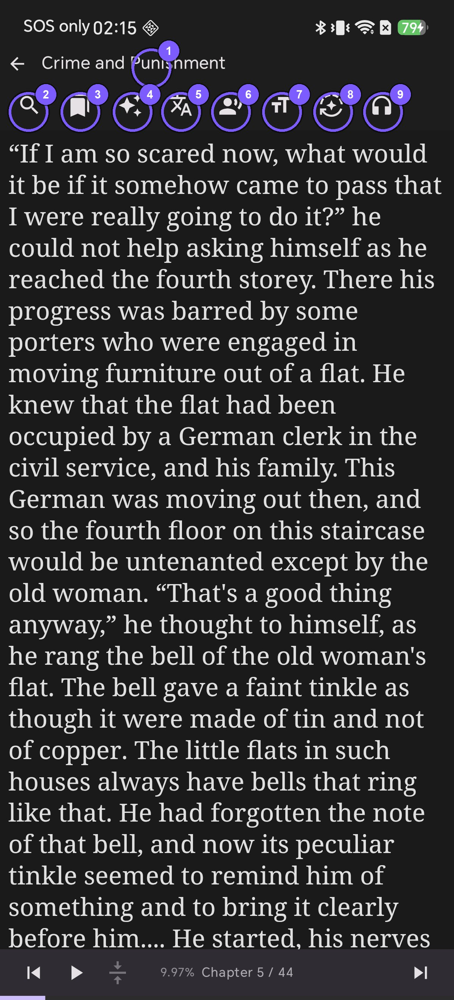

| # | Icon / Target | What Appears / Action |
| --- | --- | --- |
| 1 | Book Title | Book info dialog: cover, chapters, file size, highlights/notes counts, reading/listening stats, ratings |
| 2 | Magnifier 🔍 | Full-text search across the entire book |
| 3 | Ribbon 🔖 | List of all bookmarks, highlights, and notes in this book |
| 4 | Sparkles ✨ | Ask AI about the currently open chapter |
| 5 | Language 文A | Translation panel: source/target languages, engine, whole-book background translation |
| 6 | Speaking Head 🗣️ | Read-aloud settings: voices, speed, and pitch per language |
| 7 | Font тT | Display settings: font size, line spacing, themes, custom fonts, margins, style overrides |
| 8 | Mode Icon ⇄ / ↕ | Reading mode: Vertical scroll, Horizontal scroll, Page turn (LTR/RTL) |
| 9 | Headphones 🎧 | Full-screen audio player without interrupting playback |

### 1. Touch the Title → Book Info Dialog
Tapping the book title opens a comprehensive info card: cover artwork, author, chapter count, file size, Memory counts (highlights, notes, translations, AI chats), reading and listening duration, and star ratings.

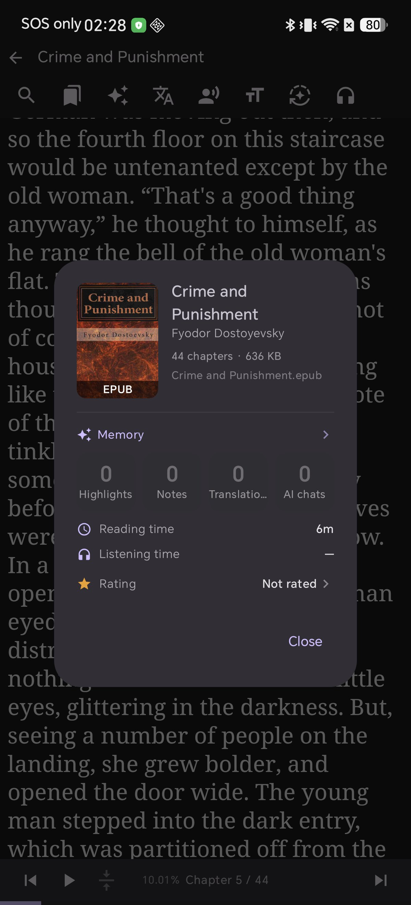

### 2. Touch the Magnifier → Full-Book Search
Type any keyword to search across the entire book, not just the visible chapter. Results display preview snippets with bold terms, exact chapter names, and percentages. Tap any result to jump straight to that passage.

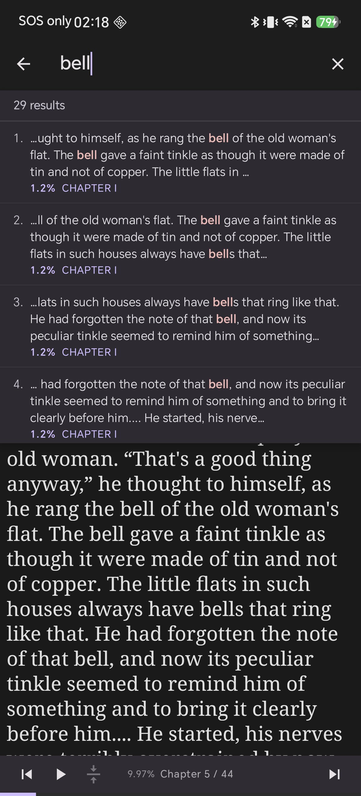

### 3. Touch the Ribbon → Bookmarks & Notes Hub
A unified hub listing every bookmark, color highlight, and note created in this book. Tap an entry to navigate back to it, or use the trash icons to delete individual items.

### 4. Touch the Sparkles → Ask AI About Chapter
Engage with on-device AI focused specifically on the chapter you are reading — ask for summaries, character motivations, or plot recaps without spoiling future chapters.

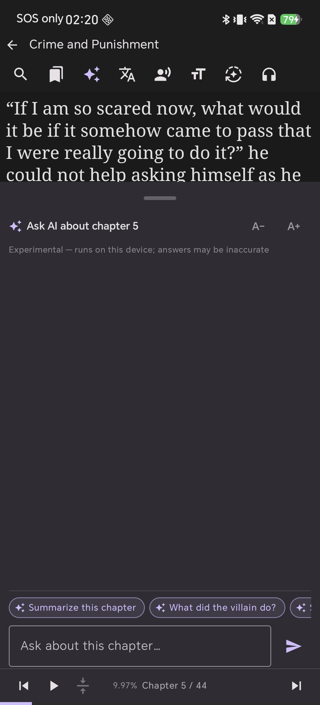

### 5. Touch 文A → Translation Panel
Configure source and target languages, choose translation engines, or trigger **Translate whole book** to batch-translate chapters seamlessly in the background.

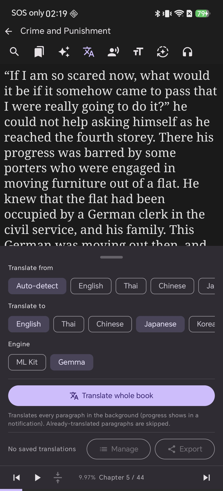

### 6. Touch the Speaking Head → Read-Aloud (TTS) Settings
Manage all enabled voice languages with individual pitch and speed sliders, skip URLs during narration, and enable floating playback controls.

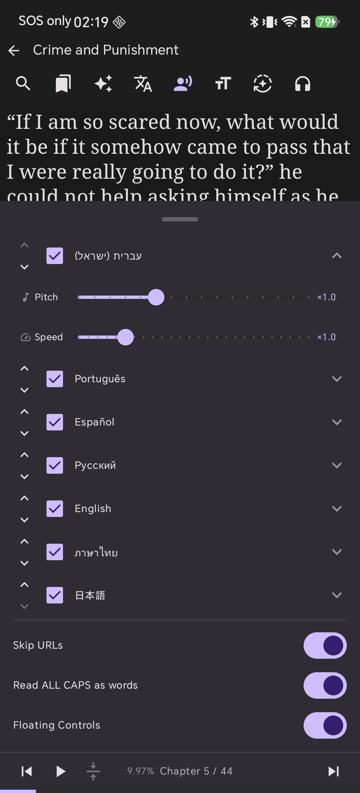

### 7. Touch тT → Display & Typography Settings
The most frequently used panel: customize font size, line height, reading themes (Light, Dark, Sepia, Gray, E-Ink), custom fonts per script, page margins, and publisher CSS overrides.

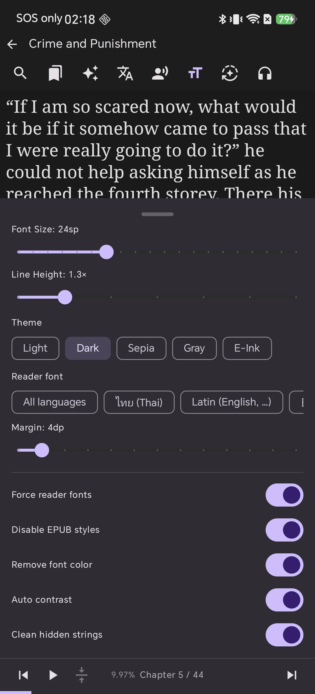

### 8. Touch the Mode Icon → Reading Modes
Switch between **Auto**, **Vertical scroll**, **Horizontal scroll** (for Japanese tategaki or emakimono scrolls), and **Page turn** with LTR/RTL reading direction controls.

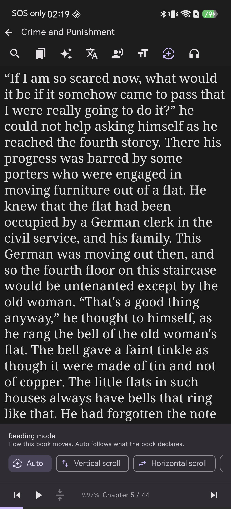

---

## The Bottom Bar — Where Playback Lives

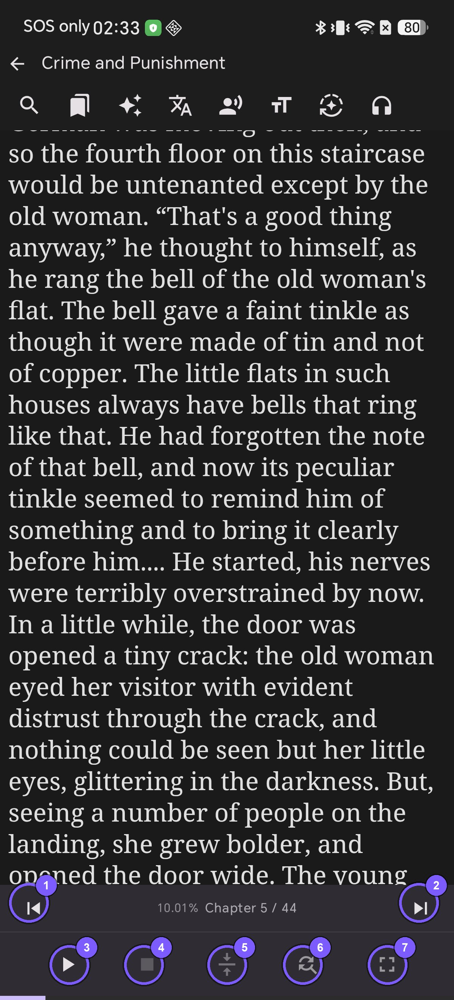

| # | Button | Action |
| --- | --- | --- |
| 1 | \|◀ | Previous chapter (or previous paragraph during TTS playback) |
| 2 | ▶\| | Next chapter (or next paragraph during TTS playback) |
| 3 | ▶ / ⏸ | Start / Pause read-aloud (**Long-press to stop** session) |
| 4 | ■ | Stop read-aloud outright |
| 5 | Center Arrows 🎯 | Keep spoken sentence centered on screen / return to voice location |
| 6 | Circular Arrows 🔤 | Quick access to Text Replacement rules |
| 7 | Corners ⛶ | Enter Immersive Full-Screen Mode |

---

## Long-Press Text: The 12-Action Selection Menu

Press and hold any word to open the floating contextual action menu:

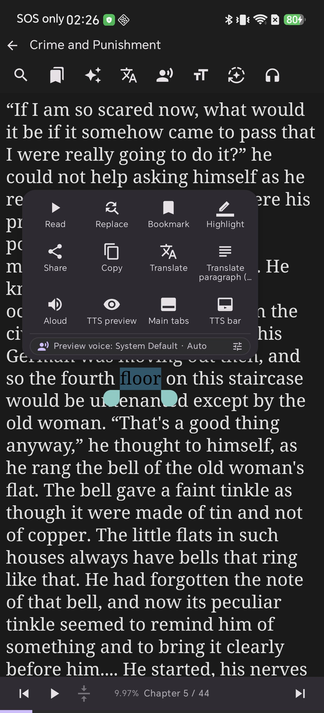

| Action | Description |
| --- | --- |
| **Read** | Starts read-aloud directly from the selected sentence |
| **Replace** | Creates a text replacement rule from the selected phrase |
| **Bookmark** | Bookmarks the paragraph instantly |
| **Highlight** | Opens the 8-color highlight palette |
| **Share / Copy** | Shares to other apps or copies text to the clipboard |
| **Translate** | Translates the selection or whole paragraph inline |
| **Aloud** | Speaks just the selected snippet once |
| **TTS Preview** | Previews spoken pronunciation with replacement rules applied |
| **Main tabs / TTS bar** | Toggle visibility of the bottom navigation and playback rows |

---

## Highlighting & Adding Notes in Two Touches

Select from 8 vibrant palette colors (Yellow, Green, Blue, Pink, Orange, Purple, Teal, Red). The highlight is applied instantly, with an optional **Add note** prompt.

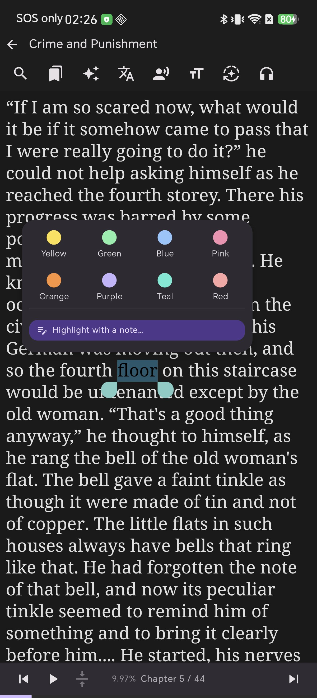

Highlights and notes live in Shiori's dedicated database and never modify your original EPUB files. Tapping any highlight later reopens its note.

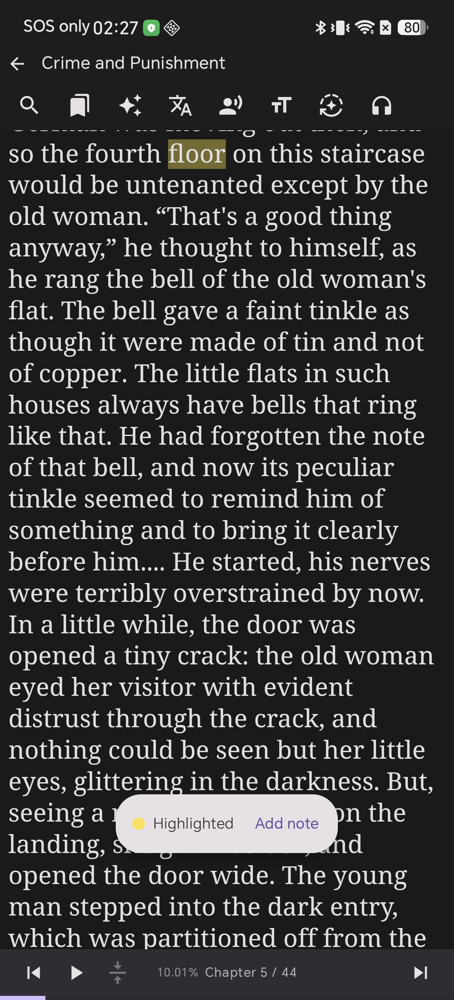

---

## Immersive Full-Screen Mode

Touch the corners icon on the bottom bar to hide all toolbars and status bars. You are left with pure book text and a compact floating audio pill. Return by pressing your device's **system back button**.

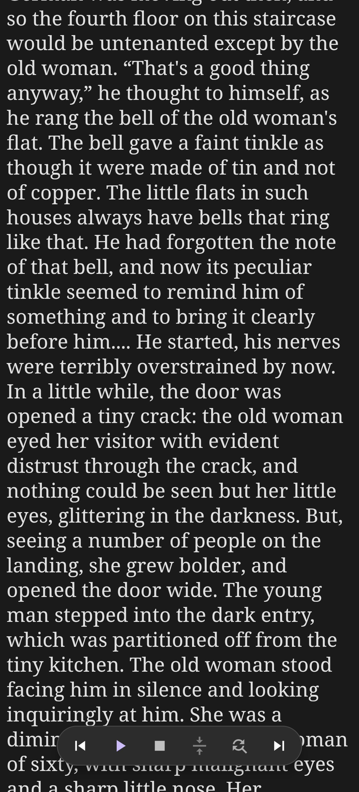

---

## Frequently Asked Questions

**Why does tapping the middle of the page do nothing?**  
This is an intentional design choice. Toolbars appearing on accidental taps interrupt reading immersion. Use the immersive button to hide toolbars, and the system back button to restore them.

**How do I switch from scrolling to page turning?**  
Open the reading mode panel (Icon 8 on the top bar) and select **Page turn**. Your choice is remembered individually for each book.

**How do I return to the sentence currently being read aloud?**  
Tap the **Center Arrows 🎯** button on the bottom bar. It instantly scrolls back and keeps the currently spoken sentence centered.

**Do my highlights and bookmarks modify the EPUB file?**  
No. All annotations are safely managed by Shiori's internal store and sync seamlessly via Google Drive Cloud Sync without touching the original EPUB file.
