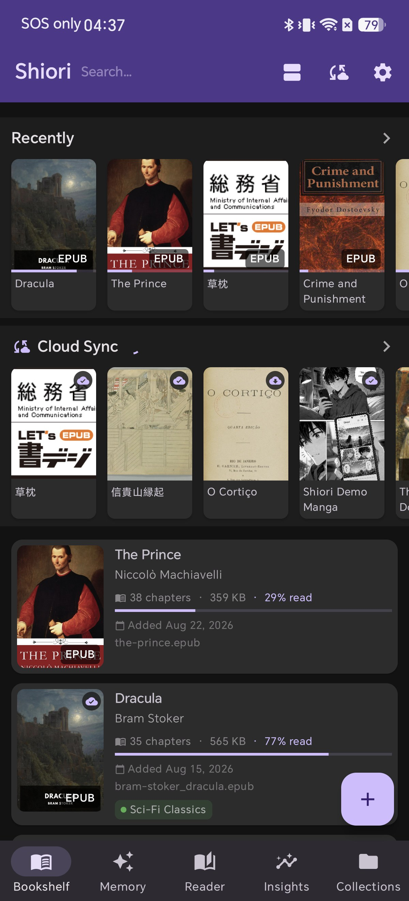
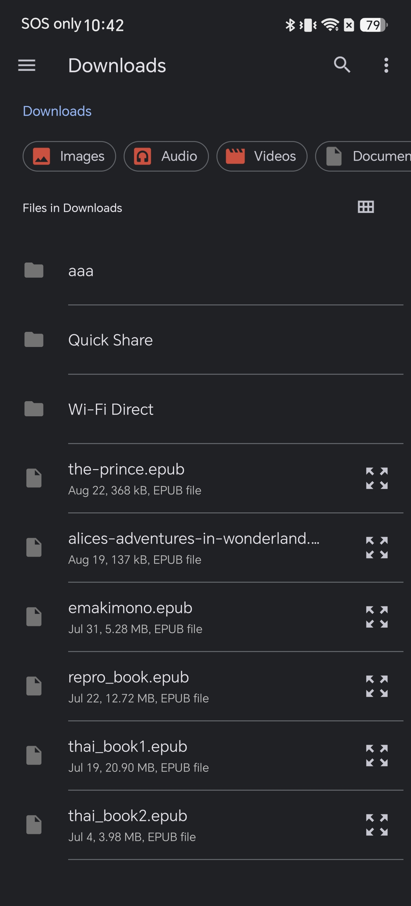
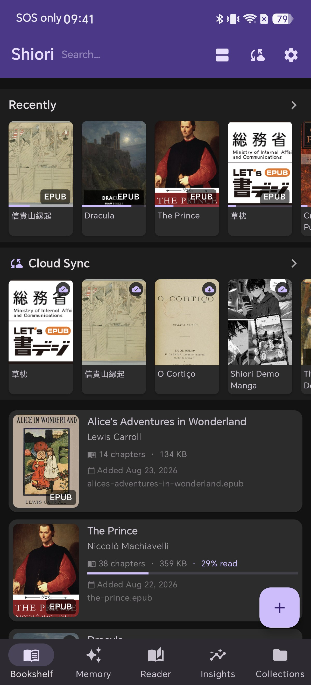
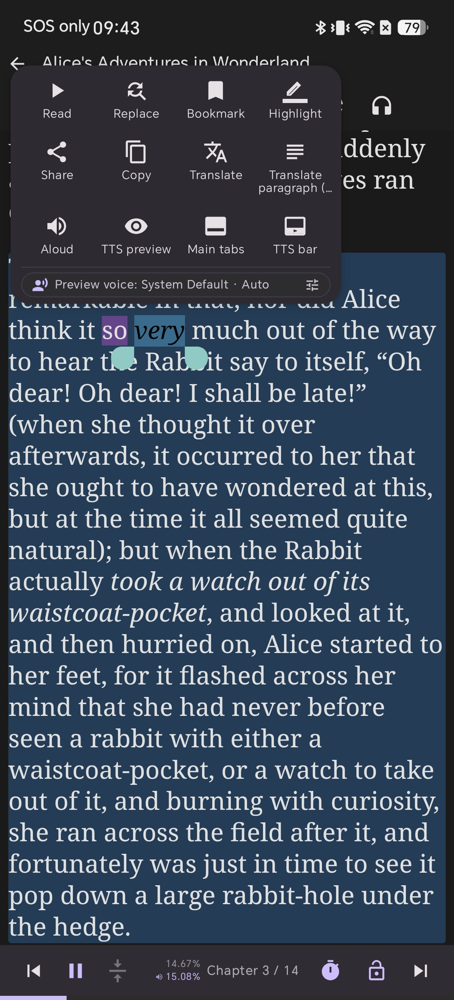
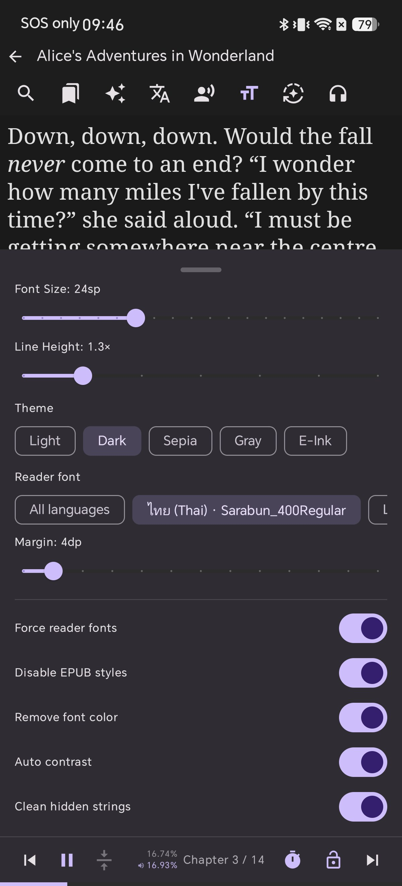

# 10 นาทีแรกของคุณกับ Shiori: คู่มือเริ่มต้นสำหรับมือใหม่

คุณเพิ่งติดตั้ง Shiori และกำลังมองหน้าชั้นหนังสือที่ว่างเปล่า พร้อมกับสงสัยว่าจะเริ่มลองอะไรเป็นอย่างแรกดี คู่มือนี้จะแนะนำ 4 สิ่งที่คุ้มค่าแก่การลองทำในสิบนาทีแรกของคุณ: การนำเข้าหนังสือ, การฟังด้วยฟังก์ชันอ่านออกเสียง, การแปลข้อความหนึ่งย่อหน้า และการเลือกธีมการอ่าน โดยแต่ละขั้นตอนด้านล่างคือการใช้งานจริงบนอุปกรณ์จริง ตามลำดับที่ผู้อ่านใหม่น่าจะได้ใช้งานมากที่สุด

นี่ไม่ใช่คู่มืออธิบายปุ่มทุกปุ่มบนหน้าจอการอ่าน — หากต้องการดูรายละเอียดส่วนนั้น โปรดดูที่ [Every Button on the Reader Screen](/blog/epub-reader-screen-guide-android/) นี่คือเส้นทางลัดผ่าน 4 ฟีเจอร์ที่สำคัญที่สุดในวันแรกของคุณ

## สิ่งที่คุณต้องมี

- แอป Shiori ePub Reader ที่ติดตั้งบนโทรศัพท์หรือแท็บเล็ต Android
- ไฟล์ EPUB, FB2, Kobo (KEPUB), PDF หรือการ์ตูน (CBZ) บนอุปกรณ์ — ไฟล์ EPUB ใดๆ ก็ใช้ทดสอบได้ หากคุณยังไม่มีหนังสือพร้อมใช้งาน วรรณกรรมคลาสสิกที่เป็นสาธารณสมบัติจาก Standard Ebooks หรือ Project Gutenberg ก็เป็นแหล่งดาวน์โหลดที่ดี

## ขั้นตอนที่ 1: นำเข้าหนังสือเล่มแรกของคุณ

เปิด Shiori ไปที่แท็บ **Bookshelf** แล้วแตะปุ่ม **+** สีม่วงที่มุมขวาล่าง

การแตะปุ่มนี้จะเปิดตัวเลือกไฟล์ของระบบ Android ขึ้นมา แทนที่จะเป็นหน้าจอนำเข้าของตัวแอปเอง ให้ลองเลือกไปยังโฟลเดอร์ที่เก็บไฟล์หนังสือของคุณไว้ — โดยทั่วไปจะอยู่ที่โฟลเดอร์ Downloads หากคุณย้ายมาจากคอมพิวเตอร์หรือดาวน์โหลดผ่านเบราว์เซอร์ — แล้วแตะเลือกไฟล์

หนังสือจะปรากฏบนชั้นหนังสือของคุณทันที พร้อมกับหน้าปก ชื่อผู้แต่ง จำนวนบท และขนาดไฟล์ที่โหลดขึ้นมาเรียบร้อยแล้ว

**ทำไมสิ่งนี้ถึงสำคัญ:** การใช้ตัวเลือกไฟล์ของระบบหมายความว่า Shiori สามารถดึงหนังสือมาจากที่ใดก็ได้ที่อุปกรณ์ของคุณเข้าถึงได้ — ไม่ว่าจะเป็นพื้นที่จัดเก็บในเครื่อง, แอปคลาวด์ หรือไฟล์ที่แชร์มาจากแอปอื่นผ่านตัวเลือก "Open with Shiori" คุณจึงไม่จำกัดอยู่แค่โฟลเดอร์เดียว นอกจากนี้ คุณยังสามารถนำเข้าหนังสือหลายเล่มพร้อมกันได้โดยเลือกหลายไฟล์ในตัวเลือกไฟล์ หนังสือเล่มใหญ่จะปรากฏบนชั้นหนังสือทันทีและโหลดให้เสร็จสมบูรณ์อยู่เบื้องหลัง

## ขั้นตอนที่ 2: ฟังหนังสือด้วยฟังก์ชันอ่านออกเสียง

เปิดหนังสือที่คุณเพิ่งนำเข้า แล้วแตะปุ่ม **play** (เล่น) บนแถบด้านล่างของหน้าจอการอ่าน เสียงบรรยายจะเริ่มขึ้นทันที และข้อความจะถูกเน้นตามจังหวะการอ่าน — โดยจะเน้นที่ย่อหน้าปัจจุบันก่อน แล้วจึงเน้นคำที่กำลังอ่านอยู่

**ทำไมสิ่งนี้ถึงสำคัญ:** การเน้นข้อความแบบสองระดับ (ย่อหน้า แล้วตามด้วยคำ) ช่วยให้คุณอ่านตามด้วยสายตาขณะฟังได้อย่างง่ายดาย ซึ่งมีประโยชน์มากสำหรับผู้ที่กำลังเรียนภาษาหรืออ่านหนังสือภาษาที่สอง ฟังก์ชันอ่านออกเสียงจะทำงานต่อเนื่องข้ามบทและอ่านได้ทั้งเล่ม สามารถเล่นต่อได้แม้คุณจะล็อกหน้าจอหรือสลับไปใช้แอปอื่น พร้อมทั้งแสดงการแจ้งเตือนที่มีภาพปก ตำแหน่งการอ่าน และตัวตั้งเวลาปิด เพื่อให้คุณหยุดฟังได้โดยอัตโนมัติ คุณสามารถปรับแต่งเสียง ความเร็ว และระดับเสียงแยกตามภาษาได้จากไอคอนรูปหัวพูดที่แถบด้านบน หากเสียงเริ่มต้นยังไม่ถูกใจคุณ

## ขั้นตอนที่ 3: แปลข้อความหนึ่งย่อหน้า

แตะค้างที่คำใดก็ได้ในข้อความเพื่อเปิดเมนูตัวเลือก จากนั้นแตะ **Translate paragraph** (แปลย่อหน้า)

ข้อความย่อหน้าที่แปลแล้วจะปรากฏในบล็อกที่มีป้ายกำกับด้านล่างข้อความต้นฉบับโดยตรง — ป้ายกำกับจะแสดงเครื่องมือแปลที่ใช้และภาษาที่แปลออกไป

**ทำไมสิ่งนี้ถึงสำคัญ:** คุณไม่จำเป็นต้องออกจากหน้าอ่านหนังสือหรือเสียตำแหน่งการอ่านเพื่อดูคำแปล และสามารถเลือกภาษาปลายทางรวมถึงเครื่องมือแปลภาษาได้จากไอคอน 文A บนแถบด้านบน — จะเลือกเครื่องมือแบบออฟไลน์ (ML Kit) เพื่อความเร็ว หรือเลือกเครื่องมือ AI บนอุปกรณ์เพื่อให้ได้ผลลัพธ์ที่เป็นธรรมชาติมากขึ้นก็ได้ การแปลครั้งแรกด้วยเครื่องมือแต่ละชนิดอาจใช้เวลานานกว่าครั้งต่อๆ ไป เนื่องจากโมเดล AI บนอุปกรณ์ต้องใช้เวลาเริ่มต้นทำงาน (warm up) หากพบว่าหน้าจอค้างอยู่ที่ "Translating…" เกินสองสามวินาที ถือเป็นเรื่องปกติในการใช้งานครั้งแรก ไม่ใช่ข้อผิดพลาด และในแผงควบคุมเดียวกันนี้ ยังสามารถแปลทั้งบทหรือทั้งเล่มอยู่เบื้องหลังได้ หากการแปลเพียงย่อหน้าเดียวยังไม่พอ

## ขั้นตอนที่ 4: เลือกธีมการอ่าน

แตะไอคอน **тT** (ตั้งค่าการแสดงผล) บนแถบด้านบนเพื่อเปิดการตั้งค่าการอ่าน จากนั้นเลือกธีมจากแถว **Theme**: Light, Dark, Sepia, Gray หรือ E-Ink

เมื่อแตะเลือกตัวเลือกใดตัวเลือกหนึ่ง — เช่น Sepia — หน้าจอการอ่านทั้งหมดจะเปลี่ยนสีทันที โดยไม่ต้องกดยืนยันหรือรีสตาร์ตแอปใหม่

**ทำไมสิ่งนี้ถึงสำคัญ:** ธีมที่เหมาะสมขึ้นอยู่กับสภาพแสงรอบตัวคุณและระดับความสบายตาของคุณในขณะนั้น โดยไม่มีกฎเกณฑ์ตายตัว Shiori จึงทำให้การสลับธีมทำได้ด้วยการแตะเพียงครั้งเดียว และบันทึกตัวเลือกของคุณไว้โดยอัตโนมัติ — ไม่มีปุ่ม "Save" ให้ต้องกด พื้นหลังสีอุ่นของธีม Sepia เป็นตัวเลือกยอดนิยมสำหรับการอ่านเป็นเวลานานในแสงสลัว หากคุณอ่านบนอุปกรณ์หน้าจอ e-paper หรือต้องการหน้าจอที่สบายตาที่สุด ธีม E-Ink จะช่วยยกระดับไปอีกขั้นด้วยการปิดแอนิเมชันทั้งหมดทั่วทั้งแอป โปรดดูรายละเอียดเพิ่มเติมที่ [Using the E-Ink Theme](/blog/eink-theme-for-android-epub-reader/)

## การแก้ไขปัญหา

**ไม่มีอะไรเกิดขึ้นเมื่อแตะ +** ตรวจสอบให้แน่ใจว่าไฟล์ที่คุณเลือกเป็นฟอร์แมตที่รองรับ (EPUB, KEPUB, FB2, PDF หรือ CBZ) ไฟล์ในฟอร์แมตอื่นจะไม่แสดงขึ้นมาให้นำเข้า หรือหากนำเข้าได้ก็จะไม่สามารถเปิดอ่านได้อย่างถูกต้อง

**อ่านออกเสียงไม่มีเสียง** ตรวจสอบระดับเสียงสื่อ (media volume) ของอุปกรณ์ ไม่ใช่แค่เสียงออด (ringer volume) หากยังคงไม่มีเสียง ให้เปิดไอคอนรูปหัวพูดบนแถบด้านบนเพื่อตรวจสอบว่าได้ตั้งค่าเสียงสำหรับภาษาของหนังสือนั้นไว้แล้วหรือไม่ — หากภาษานั้นไม่ได้ตั้งค่าเสียงไว้ แอปจะไม่มีเสียงสำหรับอ่าน

**การแปลค้างอยู่ที่ "Translating…"** ในการใช้งานโมเดล AI บนอุปกรณ์ครั้งแรกของเซสชัน โมเดลจะต้องใช้เวลาโหลดเพิ่มเติมสองสามวินาที (หรือนานกว่านั้นในบางครั้ง) ก่อนที่จะเริ่มประมวลผล หากค้างเป็นเวลานาน ให้ลองสลับไปใช้เครื่องมือ ML Kit ในแผงการแปล ซึ่งทำงานแบบออฟไลน์และไม่ต้องเสียเวลาโหลดก่อนเริ่มใช้งาน

**ธีมย้อนกลับเป็นแบบเดิม หรือดูต่างจากที่คิดไว้** ธีมจะส่งผลต่อทั้งแอป ไม่ใช่แยกตามรายเล่ม ดังนั้นหากหนังสือที่คุณอ่านอยู่มีหน้าตาเปลี่ยนไปจากเมื่อครู่ เป็นไปได้ว่าก่อนหน้านี้อยู่ในธีมอื่น — ให้ตรวจสอบแถว Theme อีกครั้งเพื่อยืนยันว่าตอนนี้เลือกธีมใดอยู่

## เคล็ดลับ

- Shiori มีโหมด Reader Only ที่ช่วยให้คุณเปิดไฟล์และเริ่มอ่านได้ทันทีโดยไม่ต้องเพิ่มลงในคลังหนังสือถาวรของคุณ — โหมดนี้จะไม่ซิงค์ไปยังคลาวด์และจะลบตัวเองหลังจากผ่านไป 30 วัน ซึ่งสะดวกมากสำหรับหนังสือที่คุณต้องการลองเปิดอ่านดูเฉยๆ
- การแปลภาษาสามารถแปลไปยังหลายภาษาได้พร้อมกันหากคุณเลือกหลายภาษาในแถว "Translate to" คุณจึงไม่ต้องตั้งค่าแผงควบคุมใหม่สำหรับแต่ละภาษา
- คุณสามารถสลับธีมขณะอ่านหนังสือได้ตลอดเวลา โดยไม่กระทบต่อตำแหน่งการอ่าน ข้อความไฮไลต์ หรือที่คั่นหนังสือของคุณ

## บทความที่เกี่ยวข้อง

- [Every Button on the Reader Screen — A Touch-by-Touch Guide to Reading EPUBs](/blog/epub-reader-screen-guide-android/)
- [Using the E-Ink Theme for Paper-Like EPUB Reading on Android](/blog/eink-theme-for-android-epub-reader/)
- [One Book, Every Voice — Multi-Language Text-to-Speech, Explained](/blog/multi-language-text-to-speech-android-epub/)
- [How to Translate EPUB to Multiple Languages Simultaneously](/blog/how-to-translate-to-multiple-language/)
- [Read Along with Karaoke Highlighting in Shiori EPUB Reader](/blog/read-along-tts-karaoke-highlight-epub-android/)
- [Drop a Book Into a Browser and Watch It Land on Your Phone — Book Drop, Explained](/blog/book-drop-send-books-to-android-over-wifi/)

## สรุปส่งท้าย

นำเข้า ฟัง แปลภาษา และเลือกธีม — ทั้งหมดนี้คือสิ่งที่คุณสามารถทำได้ในสิบนาทีแรก ทุกฟังก์ชันอื่นๆ ใน Shiori ถูกต่อยอดมาจากทั้ง 4 แอ็กชันนี้ เมื่อคุณคุ้นเคยกับฟังก์ชันพื้นฐานเหล่านี้แล้ว การสำรวจส่วนที่เหลือของแอปก็จะเป็นเรื่องง่ายและเป็นไปตามจังหวะที่คุณต้องการ