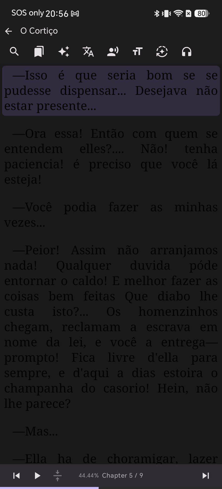
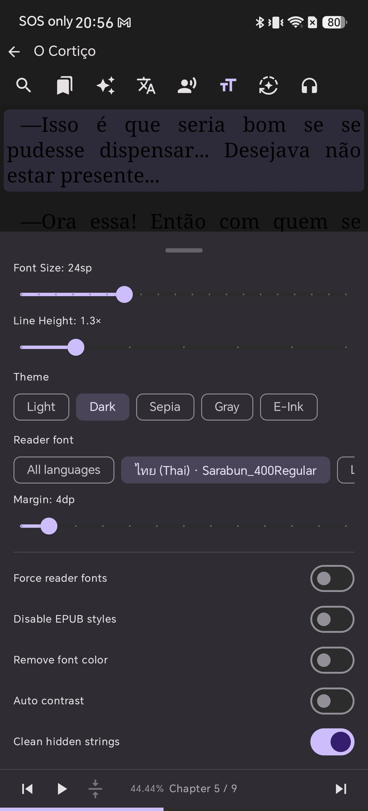
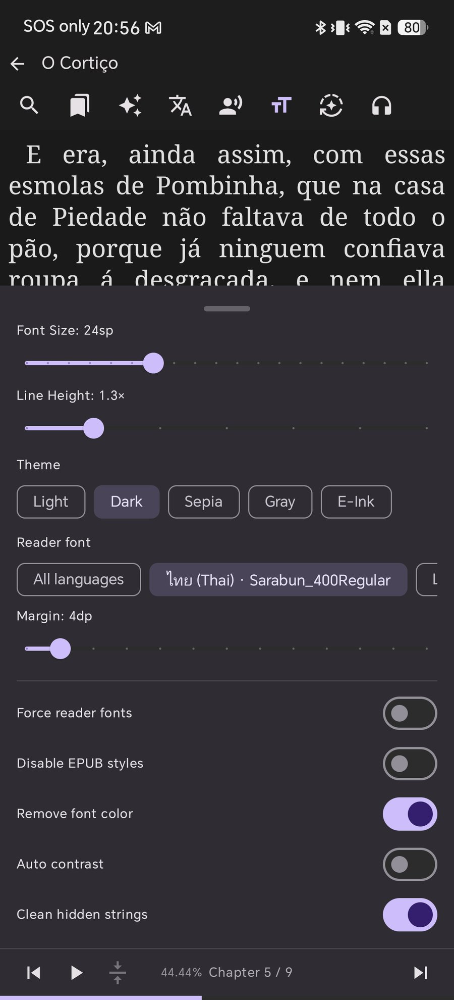
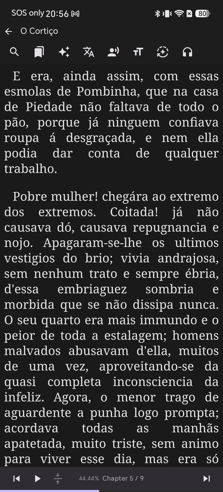
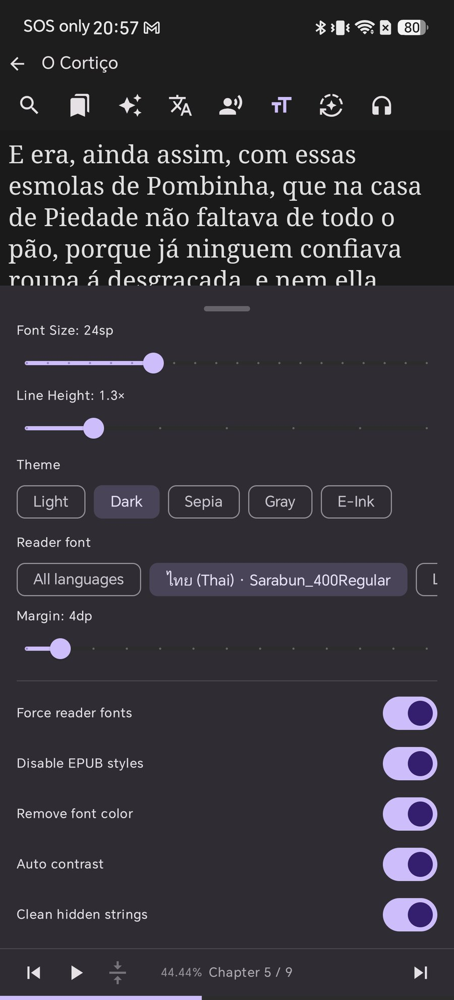
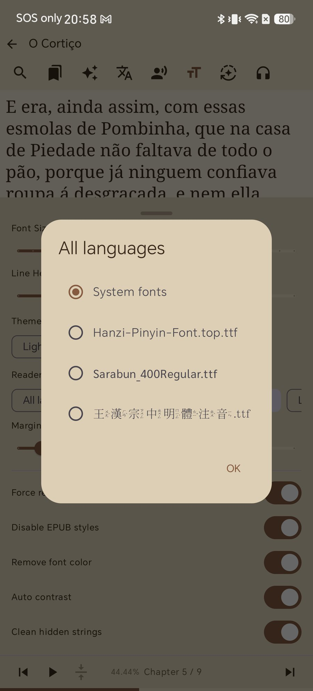
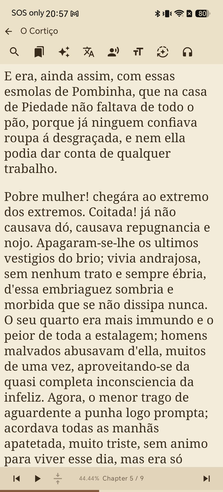

# The EPUB Is Fine, the Styling Is Broken: How to Take Back Control on Android

You download a free EPUB, open it on your phone, and the text is a smear of grey on a black page. Or the letters are half the size you set. Or every line is stretched into rivers of white space. You change the font size in your reader and nothing happens.

The file is not corrupt, and your reader is not ignoring you. An EPUB is a small website in a box: it ships its own stylesheet, and that stylesheet can pin the text colour, the font, the alignment and the spacing. When the book's own styling was written for a white page and you read on a dark one, the result is a page you cannot read.

Shiori lets you overrule the file. This guide shows the four switches that do it, what each one actually changes, and the order to try them in.

## Why a book can look broken

Three habits in EPUB stylesheets cause almost all of it:

* **A hard-coded text colour.** The file says "text is nearly black" because it assumed a white page. Switch to a dark theme and the text disappears into the background.
* **A hard-coded font and size.** The file names its own font — sometimes one embedded in the book, sometimes one your phone does not have — and states a size relative to nothing useful. Your size setting has nothing to bite on.
* **Justification with no hyphenation.** Text stretched to both margins on a narrow phone screen opens gaps between words that drag your eye down the page instead of along the line.

None of this is a bug in the book. It is a book designed for a page that is not your page.

## What you need

* Shiori installed on your Android device
* Any book that looks wrong — a free EPUB is the usual suspect

Nothing here modifies the file. Every switch below changes how Shiori renders the book, so you can turn it back off and the original styling returns untouched.

## Step 1 — See the problem clearly

Here is *O Cortiço*, a Project Gutenberg EPUB, open in Shiori on the Dark theme with every override switched off:

The text is there. It is just painted in the colour the file demands — dark on dark — and justified into wide, ragged word spacing. This is what "the book's stylesheet wins" looks like.

## Step 2 — Open the reading settings

With the book open, tap the **тT** icon in the reader's top bar. The panel slides up from the bottom, and the page stays visible above it, so you can watch every change land as you make it.

The top half is ordinary typography — **Font Size**, **Line Height**, **Theme**, **Reader font**, **Margin**. The switches underneath are the ones that decide who wins when the book disagrees with you:

* **Force reader fonts** — use your chosen font instead of the file's
* **Disable EPUB styles** — ignore the file's stylesheet altogether
* **Remove font color** — discard the colours the file specifies
* **Auto contrast** — keep the file's colours, but adjust them for legibility
* **Clean hidden strings** — tidy up junk markup that some files leave in the text

The same panel is available outside a book under **Settings → Reading**.

## Step 3 — Turn on "Remove font color" first

Invisible text is the problem worth fixing first, and it has a single switch.

Close the panel and the same passage is legible:

The text now takes its colour from your theme instead of from the file. Nothing else changed — the layout is still the book's, still justified, still indented — but you can read it.

If a book uses colour for something you want to keep (coloured headings, a marked-up textbook), try **Auto contrast** instead: it approaches the same problem from the other side, adjusting colours for legibility rather than discarding them. The reader redraws instantly, so switch between the two and keep whichever suits the book.

## Step 4 — Turn on "Disable EPUB styles" and "Force reader fonts"

Colour was only the loudest problem. Layout is the one that quietly makes a book tiring.

With those on, the same passage again:

The rivers of white space are gone, the forced first-line indents are gone, and the paragraph spacing is the one you set rather than the one the file assumed. **Disable EPUB styles** is the blunt instrument here: it drops the file's stylesheet, so your font size, line height and margin apply to every book in the same way.

**Force reader fonts** is the companion switch. Without it, a book that names its own font keeps using it — including a font embedded in the file that may render poorly at your size. With it, the book uses the font *you* picked.

## Step 5 — Pick the font that renders it

Tap **Reader font → All languages** to see what Shiori will use:

**System fonts** is the safe default. Below it sit any fonts you have imported yourself — and because the picker is per language, you can give Thai, Japanese or Chinese text a font that suits it while leaving Latin text alone. That matters for scripts where a generic fallback font places marks badly. If you want your own typeface here, [How to Import Custom Fonts into Shiori](/blog/how-to-import-custom-epub-fonts/) covers the import step.

## Step 6 — Now your theme actually applies

Once the file's colours are out of the way, a theme change does what it should. The same book, one tap later, on Sepia:

Light, Dark, Sepia, Gray and E-Ink all behave this way — the page and the text change together, because the text colour is now Shiori's decision and not the file's. For long sessions on e-paper hardware, [the E-Ink theme](/blog/eink-theme-for-android-epub-reader/) takes this further and strips motion out as well.

## Troubleshooting

* **The text is still an odd colour.** Both colour switches address this from different directions. If **Auto contrast** is on by itself, add **Remove font color**; the file may be specifying a colour that survives adjustment.
* **The font still is not yours.** **Remove font color** and **Disable EPUB styles** do not touch fonts. You need **Force reader fonts**, and a font selected under **Reader font**.
* **Font size still does nothing.** The file is sizing text in units your setting cannot override. Turn on **Disable EPUB styles**.
* **The book now looks plain.** That is the trade. **Disable EPUB styles** throws away deliberate design along with the broken parts, so for a well-made book, turn it back off and keep only the colour switch.
* **Odd stray characters in the text.** Leave **Clean hidden strings** on — it is Shiori's tidy-up pass for files with junk left in the markup, which also keeps read-aloud and highlighting aligned with what you see.

## Tips

* **Change one switch at a time.** The reader redraws behind the panel, so you can see exactly what each one did instead of guessing at the combination.
* **These are your defaults, not the book's.** The switches apply to your reading, so a badly styled file you open next month arrives already fixed.
* **Judge with a real page, not a title page.** Chapter openings are often styled differently from the body. Scroll into ordinary prose before deciding.
* **Free EPUBs vary wildly.** Files from different sources are typeset to very different standards — see [5 Best Sites to Download Free EPUB Books](/blog/free-epub-sources/) for the ones that are usually clean.

## Related reading

* [How to Import Custom Fonts into Shiori](/blog/how-to-import-custom-epub-fonts/) — put your own typeface in the picker, per language
* [Every Button on the Reader Screen](/blog/epub-reader-screen-guide-android/) — where тT sits among the reader's other controls
* [How to Use the E-Ink Theme](/blog/eink-theme-for-android-epub-reader/) — the highest-contrast, lowest-distraction way to read

## The book should follow you

A stylesheet written years ago for a white page on a desktop screen should not decide how you read tonight. Four switches — colour, styles, fonts, contrast — hand that decision back to you, and they stay set for every book you open afterwards.

Open the book that has been annoying you, tap **тT**, and start with **Remove font color**.
