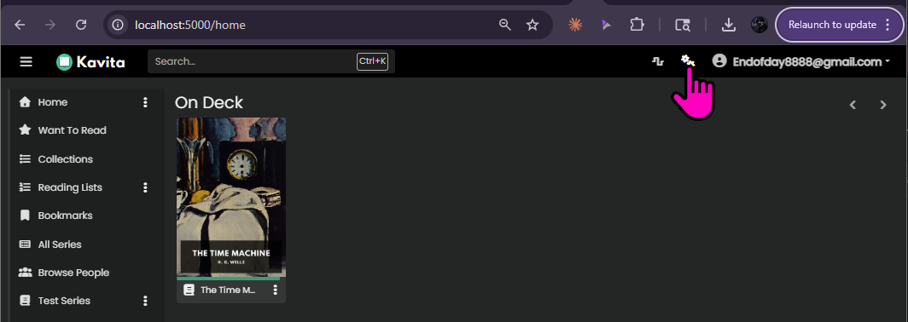
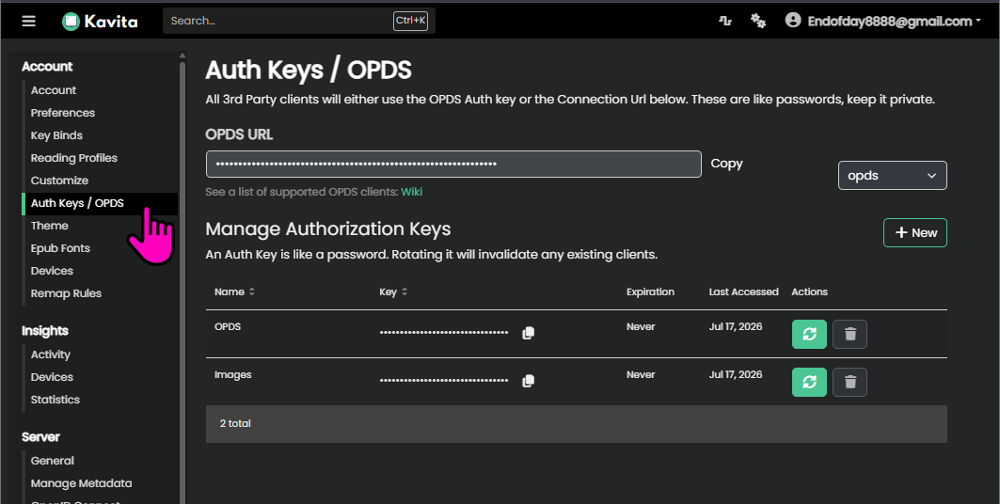
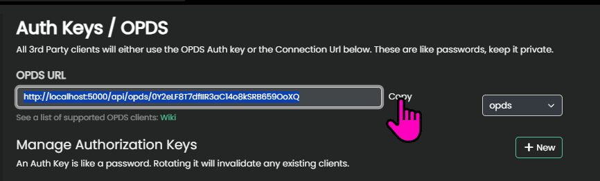
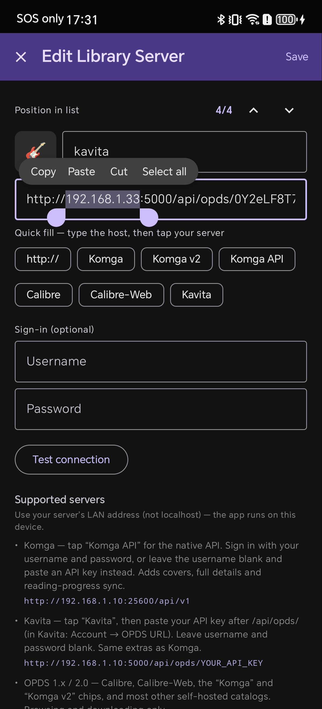
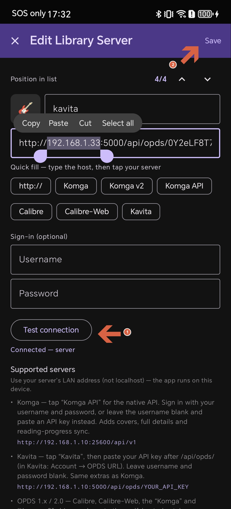
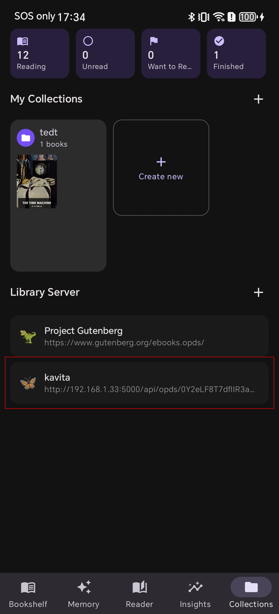
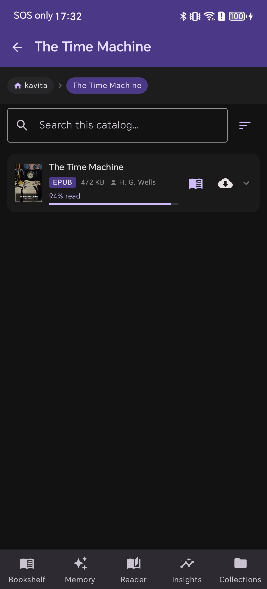

ในส่วนของ web ที่รัน kavita

1. go to kavita server 

2. click Auth Keys / ODPS 

3. looking for OPDS URL 

ในส่วนของ app 

5.1 เลือก menu collection ที่มุมขวาล่าง
5.2 กด icon + ที่ section "Library Server" 
 

6. input opds url และเปลี่ยน host จาก localhost ให้เป็น ip address ของเครื่อง server  

7.1 touch Test Connection ถ้าสำเร็จ จะขึ้นข้อความว่า connected server ที่ด้านล่างของ ปุ่ม Test connection
7.2 touch save ที่มุม ขวา บน 
 

8. จะเห็น kavita server ปรากฏขึ้นมาในรายการ
 

9. touch into the kavita server คุณก็จะเห็นรายการหนังสือพร้อม progressing ที่คุณอ่านอยู่ หนังสือที่ ที่อ่านผ่าน แอพ shiori จะ sync progessing reading กับ kavita อย่าง seamless 
