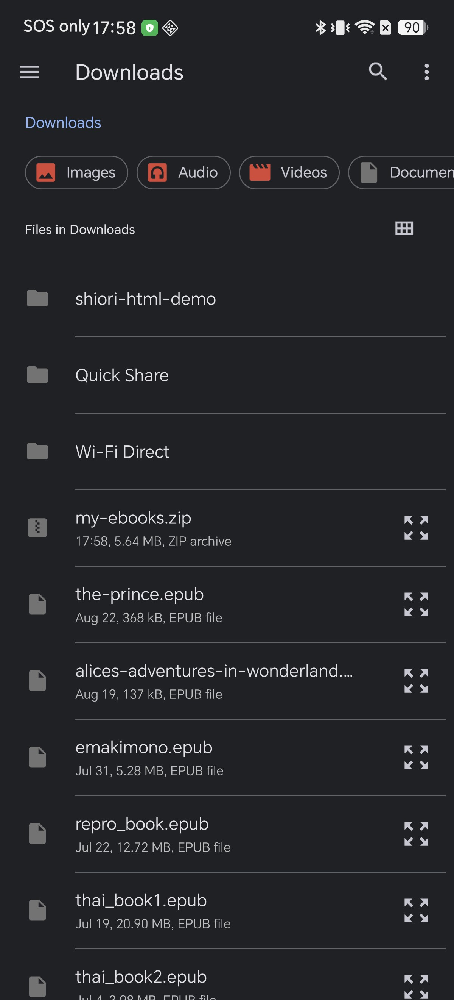
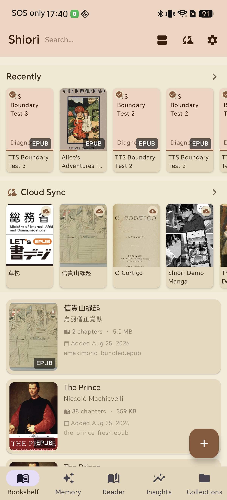

# Import Several Books at Once: Add a ZIP Full of Ebooks to Shiori

You just downloaded a course archive, a story bundle, or a folder of books someone shared with you, and it landed on your phone as one `.zip` file with half a dozen books inside it. The usual routine is to find a file manager, extract the archive, and import the books one by one — an extra step every single time.

Shiori skips that step. Point the file picker at the ZIP itself, and Shiori unpacks it and adds every book inside straight to your shelf.

## What happens when you import a ZIP

Shiori's file picker treats a `.zip` archive the same way it treats any book file — it is never greyed out or hidden from the list. Select it, and Shiori looks inside, pulls out each supported book, and adds it to your library as its own entry: its own cover, its own title and author read from the file's metadata, its own reading progress. Nothing stays bundled — by the time the import finishes, the ZIP itself is no longer needed and each book behaves exactly like one you imported individually.

This is the same "import several books at once" behavior Shiori uses for a folder of loose files — a ZIP is just a convenient way to hand it several files in one selection.

## What you need

* Shiori installed on your Android device
* A `.zip` file containing one or more supported books (EPUB, KEPUB, FB2, PDF, or CBZ), somewhere the file picker can reach — Downloads is the usual place

Nothing here modifies the original ZIP. Shiori copies the books it finds into the app's library and leaves your download exactly where it is.

## Step 1 — Pick the ZIP in the file picker

On the bookshelf, tap the **+** button in the bottom-right corner. The system file picker opens to browse your device. A ZIP archive shows up in the list looking just like every other file — same row style, same preview thumbnail — because Shiori doesn't ask for a book file specifically, it asks for a file it can read, and it can read what's inside a ZIP too.

Tap the archive the same way you would tap any single book.

## Step 2 — Each book lands on the shelf on its own

Shiori opens the archive, finds every book file inside it, and imports each one separately. In this example, one ZIP held two completely different books — a public-domain philosophy text and an illustrated Japanese scroll — and both appear as independent entries with their real titles, authors, and cover art pulled from the files themselves, not from the ZIP's filename.

From here they read like anything else in your library: reading position, bookmarks, translation, read-aloud, and the full reader top bar all work the same way whether a book arrived on its own or packed inside an archive with five others.

## Troubleshooting

* **A book from the ZIP doesn't show up as new.** Shiori checks each book it finds against what's already on your shelf and won't create a duplicate of one you already own — the same recognition it uses for Book Drop transfers. If a title is missing from the "just imported" set, it's most likely already in your library under its existing entry.
* **The ZIP doesn't appear in the picker at all.** Files copied onto the device over USB sometimes aren't indexed by Android yet. Open the file once in a file manager, or reboot the device, and it will show up.
* **Nothing importable was found.** A ZIP that contains only images, subtitles, or other non-book files has nothing for Shiori to extract. Check what's actually inside the archive on a computer first.
* **The book has the wrong title or author.** That metadata comes from the file itself, not the ZIP or the filename — some sources leave it blank or wrong. Rename or edit the entry from the bookshelf once it's imported.

## Tips

* **This is the fastest way to move a whole folder at once.** Zip a folder on your computer before transferring it, and the whole batch becomes a single tap on the phone instead of a multi-select scroll through dozens of files.
* **Mixed formats in one ZIP are fine.** An archive with a couple of EPUBs, a PDF, and a CBZ imports each into the right kind of book — Shiori sorts by file type, not by archive.
* **Large archives take a moment.** Big books "appear on the shelf instantly and finish loading in the background" the same way a single large import does — give it a few seconds before assuming an import failed.
* **Use [Collections](/blog/organize-ebooks-with-collections-android/) right after a big import** to group everything that just arrived before it mixes into the rest of your shelf.

## Related reading

* [Book Drop: Send Books to Your Android Phone Over Wi-Fi](/blog/book-drop-send-books-to-android-over-wifi/) — no cable, no cloud, drag files from a computer instead of picking a ZIP on the phone
* [Organize Your Ebooks with Collections](/blog/organize-ebooks-with-collections-android/) — group a big batch import into something browsable
* [Your First 10 Minutes with Shiori](/blog/first-10-minutes-with-shiori-android/) — the basics, if this is your first import

## One tap instead of several

The books were always going to end up on your shelf one way or another. Skipping the extraction step just means one less thing standing between the download and the first page.
