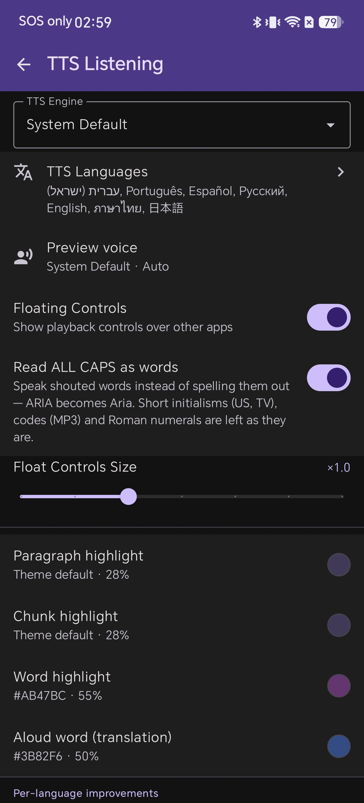
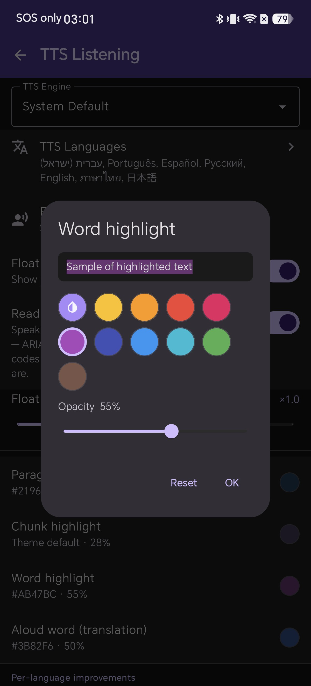
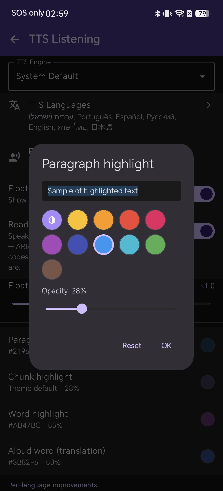
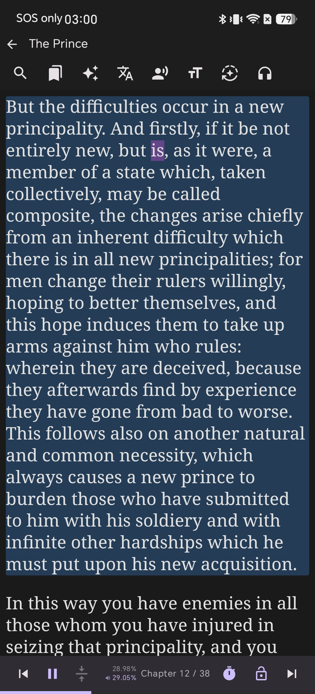
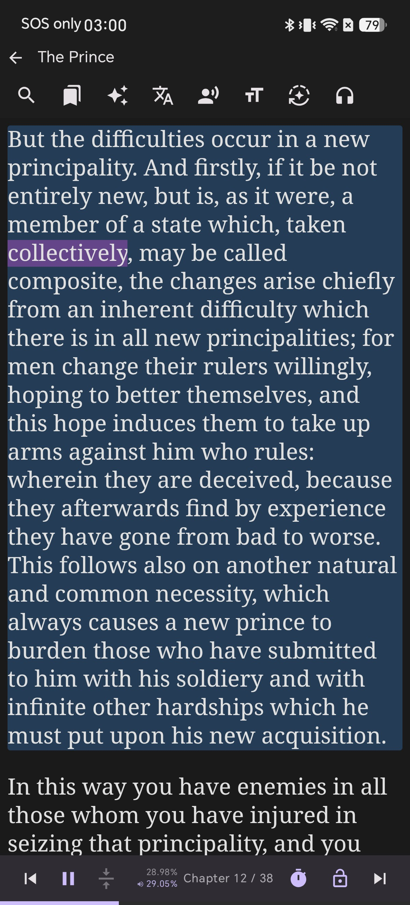

# อ่านไปพร้อมกับฟังด้วยการไฮไลต์แบบคาราโอเกะใน Shiori EPUB Reader

การฟังเสียงอ่านสังเคราะห์ (TTS) ไปพร้อมกับการกวาดสายตาอ่านข้อความบนหน้าจอ หรือที่มักเรียกว่าการอ่านแบบสองช่องทาง (bimodal reading) เป็นหนึ่งในวิธีที่มีประสิทธิภาพที่สุดในการเพิ่มความเข้าใจในการอ่าน ช่วยเสริมสมาธิ และช่วยในการเรียนรู้ภาษาใหม่ๆ เมื่อดวงตาและหูของคุณได้รับข้อมูลเดียวกันไปพร้อมกัน สมองจะสามารถประมวลผลคำศัพท์และโครงสร้างประโยคได้เร็วกว่าการฟังหรือการอ่านเพียงอย่างเดียวมาก

อย่างไรก็ตาม แอปอ่านหนังสือหลายตัวมักแยกประสบการณ์การฟังเสียงกับการอ่านออกจากกันโดยสิ้นเชิง บางแอปเล่นเสียงแต่ไม่แสดงว่ากำลังอ่านถึงจุดไหนของบท ในขณะที่บางแอปใช้แถบไฮไลต์สีจัดจ้านที่รบกวนสายตาและไม่เข้ากับธีมมืดหรือหน้าจอ AMOLED

Shiori EPUB Reader ช่วยแก้ปัญหานี้ด้วยระบบไฮไลต์แบบคาราโอเกะที่ซิงค์กับเสียงอ่านในตัว ขณะที่เสียงกำลังอ่านออกเสียง Shiori จะติดตามข้อความได้หลายระดับ ทั้งระดับย่อหน้า ท่อนประโยค/วลี และคำแต่ละคำ พร้อมทั้งเปิดโอกาสให้คุณปรับแต่งสีและความโปร่งใสของไฮไลต์ให้เข้ากับสไตล์การอ่านของคุณได้ คู่มือนี้จะแสดงวิธีตั้งค่าและปรับแต่งการไฮไลต์แบบคาราโอเกะบนอุปกรณ์ Android ของคุณ

## ทำไมการไฮไลต์แบบคาราโอเกะที่ซิงค์กับเสียงอ่านจึงสำคัญ

ไม่ว่าคุณจะกำลังเรียนภาษาต่างประเทศ อ่านบทความวิชาการที่ซับซ้อน หรือมีอาการตาล้าจากการอ่านบนหน้าจอดิจิทัล การไฮไลต์ข้อความที่ซิงค์กับเสียงอ่านจะมอบข้อดีที่โดดเด่นดังนี้:

* **การเรียนภาษาและการออกเสียง**: ฟังการออกเสียงของเจ้าของภาษาไปพร้อมกับการดูตัวสะกดและการเว้นวรรคคำแบบเรียลไทม์
* **ช่วยเรื่องสมาธิและผู้มีภาวะ ADHD**: แถบไฮไลต์ที่ขยับตามเสียงอ่านจะทำหน้าที่เป็นจุดยึดสายตา ช่วยไม่ให้สายตาหลุดโฟกัสจากหน้าหนังสือเมื่อต้องอ่านย่อหน้าที่มีเนื้อหาแน่น
* **ความเปรียบต่างที่สบายตา**: ด้วยพรีเซ็ตสีที่ปรับแต่งได้และตัวควบคุมความโปร่งใส ทำให้ไฮไลต์ดูสบายตาไม่ว่าจะใช้งานในธีมสว่างสำหรับกลางวันหรือโหมดมืดสนิท

## สิ่งที่คุณต้องมี

* ติดตั้ง Shiori บนอุปกรณ์ Android ของคุณ (ทดสอบบน v2.3.4)
* หนังสือ EPUB เล่มใดก็ได้ในคลังของคุณ (คู่มือนี้ใช้หนังสือ *The Prince* โดย Niccolò Machiavelli)
* เปิดใช้งานเอ็นจิน Text-to-Speech บน Android แล้ว (เช่น Google Speech Services หรือเอ็นจินเริ่มต้นของระบบในอุปกรณ์ของคุณ)

## ขั้นตอนที่ 1: เปิดการตั้งค่า TTS Listening

คุณสามารถกำหนดการตั้งค่าไฮไลต์ได้โดยตรงจากการตั้งค่าของแอปก่อนเริ่มเล่นเสียงอ่าน:

1. จากหน้ารวมหนังสือ (Bookshelf) ให้แตะไอคอน **Settings** ที่แถบเครื่องมือด้านบน
2. เลือก **TTS Listening** เพื่อเปิดหน้าจอกำหนดค่าการอ่านออกเสียง
3. เลื่อนลงมาที่ส่วนการไฮไลต์ คุณจะเห็นตัวควบคุมแยกต่างหากสำหรับ **Paragraph highlight**, **Chunk highlight**, **Word highlight** และ **Aloud word (translation)**

## ขั้นตอนที่ 2: ปรับแต่งสีและความโปร่งใสของ Word Highlight

การไฮไลต์คำ (Word highlight) คือเคอร์เซอร์ "คาราโอเกะ" ที่จะขยับจากคำหนึ่งไปยังอีกคำหนึ่งตามที่เสียงอ่านเปล่งออกมา

1. แตะที่ **Word highlight** ในเมนู TTS Listening
2. หน้าต่างเลือกสีจะปรากฏขึ้นพร้อมพรีเซ็ตสี 10 สี (รวมถึงสีม่วง สีเหลือง สีส้ม สีแดง สีน้ำเงิน และสีเขียว) ควบคู่ไปกับตัวเลือกสีเริ่มต้นของธีม
3. ใช้แถบเลื่อน **Opacity** ใต้แถบสีเพื่อปรับระดับความโปร่งใส (เช่น 50–55% จะช่วยให้อ่านตัวหนังสือได้อย่างชัดเจนโดยไม่บดบังข้อความด้านล่าง)
4. ตรวจสอบตัวอย่างการแสดงผลแบบเรียลไทม์ในกล่อง **Sample of highlighted text** จากนั้นแตะ **OK** เพื่อบันทึกการตั้งค่าของคุณ

## ขั้นตอนที่ 3: กำหนดค่าการไฮไลต์ย่อหน้าและท่อนประโยค

นอกจากการติดตามในระดับคำแล้ว Shiori ยังสามารถไฮไลต์ทั้งย่อหน้าหรือท่อนวลีที่กำลังอ่านอยู่ เพื่อช่วยให้เห็นบริบทโดยรวมได้ชัดเจนขึ้น:

1. แตะที่ **Paragraph highlight** ในรายการการตั้งค่า
2. เลือกสีโทนอ่อนและระดับความโปร่งใสแบบบางๆ (เช่น 25–30%) เพื่อให้กรอบย่อหน้าช่วยตีกรอบพื้นที่การอ่านโดยไม่เด่นแย่งสายตาไปจากคำที่กำลังอ่านอยู่
3. แตะ **OK** เพื่อยืนยัน

## ขั้นตอนที่ 4: เริ่มการอ่านออกเสียงและดูการไฮไลต์ตามข้อความแบบเรียลไทม์

เมื่อตั้งค่าสีและระดับความโปร่งใสตามที่ต้องการเรียบร้อยแล้ว ให้เปิดหนังสือเพื่อดูการติดตามแบบคาราโอเกะแบบเรียลไทม์:

1. เปิดหนังสือเล่มใดก็ได้จากหน้ารวมหนังสือของคุณ
2. แตะปุ่ม **Play / Pause** บนแถบควบคุมด้านล่าง (หรือแตะไอคอนหูฟังที่แถบเครื่องมือด้านบน)
3. เมื่อเอ็นจิน TTS เริ่มอ่านออกเสียง Shiori จะไฮไลต์ย่อหน้าที่กำลังอ่านด้วยสีกรอบที่คุณเลือกไว้ และเลื่อนเคอร์เซอร์ไฮไลต์สีม่วงไปตามแต่ละคำที่อ่านอย่างลื่นไหล

## ขั้นตอนที่ 5: เล่นเสียงต่อเนื่องแบบซิงค์ข้ามบท

ขณะที่คุณฟังและอ่านตาม Shiori จะเลื่อนหน้าจออัตโนมัติเพื่อให้ประโยคที่กำลังอ่านอยู่กึ่งกลางหน้าจอเสมอ คุณสามารถควบคุมการเล่นเสียงได้จากแถบเครื่องมือด้านล่าง:

* **Play / Pause**: เริ่มหรือหยุดการอ่านออกเสียงชั่วคราวได้ตลอดเวลา
* **Skip Previous / Next**: ข้ามไปยังย่อหน้าก่อนหน้าหรือถัดไปโดยไม่หลุดการซิงค์
* **Speed & Pitch**: ปรับความเร็วและระดับเสียงอ่านให้เข้ากับจังหวะการอ่านที่คุณสบายใจ
* **Continuous Reading**: Shiori จะอ่านต่อเนื่องข้ามบทได้อย่างราบรื่น พร้อมเปลี่ยนหน้าและเลื่อนจอให้อัตโนมัติโดยที่คุณไม่ต้องคอยกดเลื่อนเอง

## เคล็ดลับเพิ่มเติม

* **Floating Controls**: เปิดใช้งาน **Floating Controls** ในการตั้งค่า TTS Listening หากคุณต้องการให้แถบควบคุมการอ่านยังคงใช้งานได้สะดวกขณะสลับไปใช้แอปอื่นหรือจดโน้ต
* **Per-Language Voices**: Shiori ให้คุณกำหนดเอ็นจิน TTS และรูปแบบเสียงที่เฉพาะเจาะจงสำหรับภาษาต่างๆ ได้ที่เมนู **TTS Languages** เพื่อให้มั่นใจได้ถึงการออกเสียงที่ถูกต้องสำหรับหนังสือหลายภาษาในคลังของคุณ
* **Read Selected Text**: หากคุณต้องการฟังเฉพาะประโยคยากๆ เพียงประโยคเดียวแทนที่จะเล่นเสียงทั้งบท ให้แตะค้างที่ข้อความในหน้าอ่านแล้วเลือก **Speak** จากเมนูบริบท