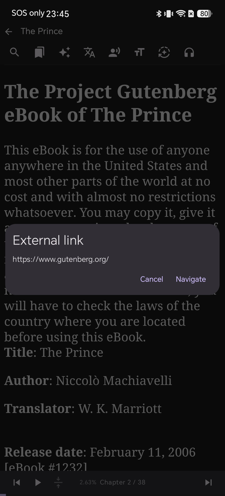

# 无需跳转页面即可直接阅读脚注与内链 (Android)

阅读学术著作、注释版名著或带有大量文末尾注的书籍时，最令人头疼的体验莫过于点击脚注链接后瞬间被跳跃至文件末尾，读完注释却再也找不到原来读到了哪一行。

Shiori 重新设计了书内链接与脚注的交互逻辑：点击脚注或跨章节引用时，应用会在屏幕底部弹出**悬浮卡片预览**，无需跳转页面即可直接阅读注释；而点击跳转至外部网站的链接时，则会弹出确认对话框，防止误触退出阅读。

## 为什么这对深度阅读至关重要

图书内链与外部网页链接在排版上非常相似，但交互意图截然不同：

* **图书内链（脚注/尾注）：** 属于短暂停留，读者希望快速看一眼便继续回到正文。
* **外部网络链接：** 会直接跳出阅读器并启动浏览器，通过二次确认可有效保护阅读连贯性。

## 准备工作

* 在 Android 设备上安装 Shiori 阅读器（测试版本 v2.3.4c11）
* 包含脚注或尾注引用的 EPUB 文件（如 Project Gutenberg 的公有领域经典著作《君主论》）

## 步骤 1: 在正文中发现脚注引用标记

脚注在段落中显示为带有小链条图标的上标数字，例如《君主论》第三章中的 `Lodovico[1]`。排版自然优雅，直观提示该标记包含可点击查看的详细注释。

## 步骤 2: 轻触即可呼出底部悬浮预览

点击脚注引用，页面完全不会跳动，屏幕底部会优雅升起一张包含章节标题与注释正文的预览卡片，下方提供 **Cancel** 和 **Navigate** 按钮。

快速阅读完注释后，点击 **Cancel** 即可关闭卡片，无缝衔接刚才读到的位置。

## 步骤 3: 如需完整阅读，可点击 "Navigate" 跳转

如果该条注释内容较长，需要查看完整段落，点击 **Navigate**。Shiori 会平滑滚动至图书内部该注释所在的原位置，全程保持在书内阅读状态。

## 步骤 4: 外部网页链接获得专属安全处理

电子书中的链接并非全指向本文件内部，扉页、版权页与文献索引中经常包含真实外部网址（如 `www.gutenberg.org`）。

## 步骤 5: 离开阅读器前的专属安全确认

点击外部链接时，Shiori 会弹出 **External link** 提示框，清晰列出完整的访问网址（`https://www.gutenberg.org/`）。点击 **Cancel** 即可安全留在当前阅读界面，点击 **Navigate** 方调用浏览器。

## 故障排查 (Troubleshooting)

**点击脚注时没有弹出预览，而是直接跳页**  
部分制作不规范的 EPUB 文件未采用标准 HTML 锚点链接。数字旁若无链条图标，说明出版社仅将其排版为纯文本。

**悬浮卡片中的注释文本显示不全**  
预览卡片主要用于快速查阅。若注释较长，点击 **Navigate** 即可前往阅读完整内容。

## 相关阅读

* [How to Highlight Text and Take Notes in an Android EPUB Reader](/blog/highlight-and-take-notes-epub-android/)
* [5 Best Sites to Download Free EPUB Books](/blog/free-epub-sources/)
