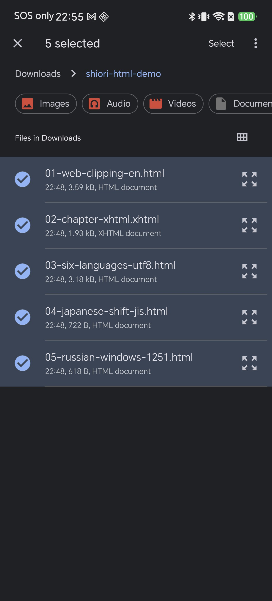
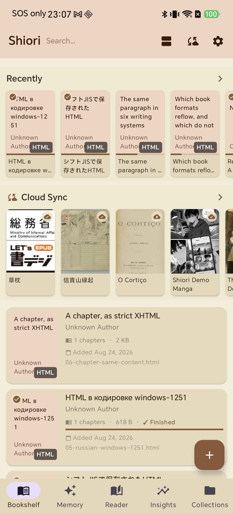
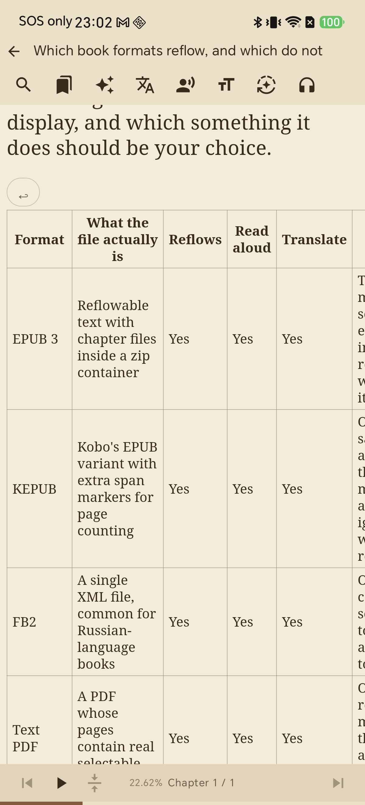
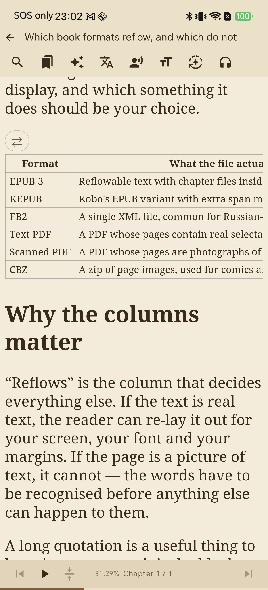
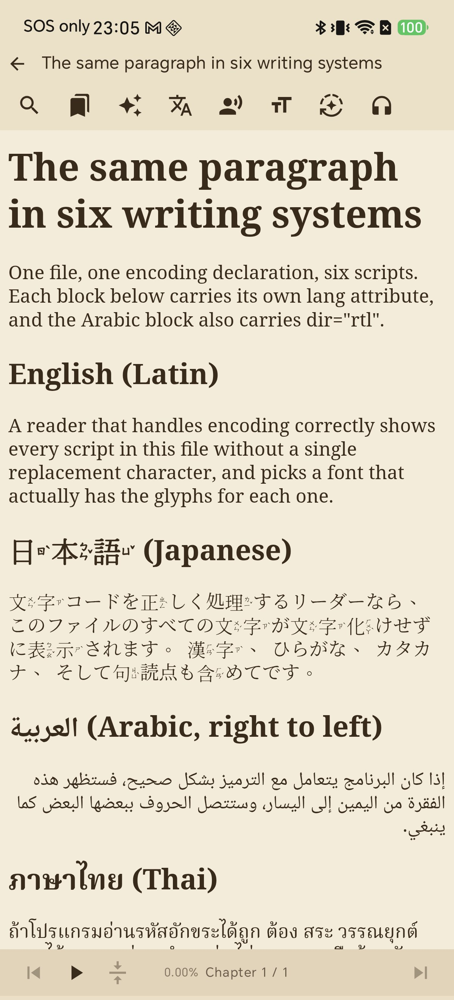
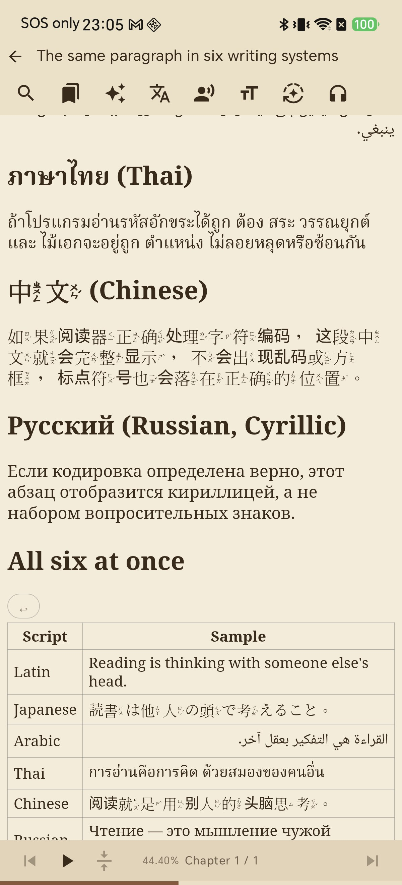
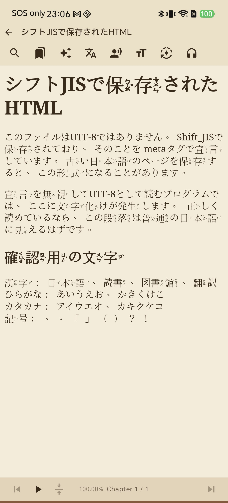
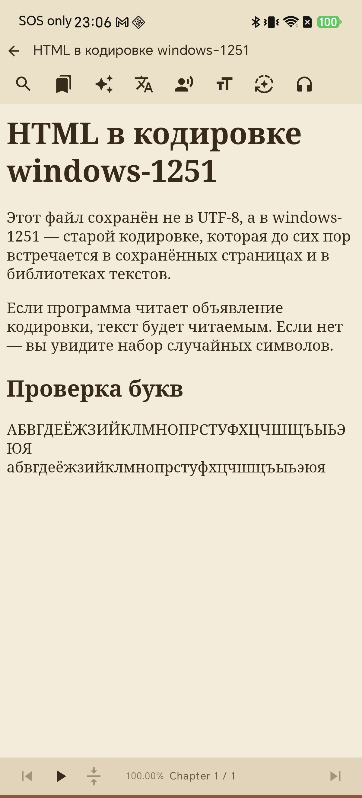

# Read Saved Web Pages on Your Phone: Importing HTML Files into Shiori

You save a long article from your browser. You export a page of documentation. Someone sends you a chapter that was pulled out of an ebook. All of it is HTML, and all of it ends up in your Downloads folder — where it stays, because tapping it opens a browser tab with no font control, no themes, no bookmarks, and no place to leave a note.

Shiori treats an HTML file as a book. Import it once and it sits on the bookshelf next to your EPUBs, with the same reading tools attached to it.

This guide covers the import, the one control that matters for pages containing wide tables, and what happens to pages written in scripts other than Latin — including files that are not saved in UTF-8.

## What Shiori does with an HTML file

It reads the markup, not a picture of the page. Headings stay headings, lists stay lists, tables stay tables, and the text reflows to your screen width, your font and your margins — the same way an EPUB chapter does.

Two details are worth knowing before you start:

* **The book title comes from the file's `<title>` tag**, not from the filename. A page saved as `article(3).html` will still appear on the shelf under its real title.
* **The character encoding comes from the file's own declaration.** A page that says it is Shift_JIS is read as Shift_JIS, not guessed at as UTF-8. This is the difference between readable text and a screen of replacement characters.

## What you need

* Shiori installed on your Android device
* One or more `.html` files somewhere the file picker can reach — the Downloads folder is the usual place

Nothing here modifies the original file. Importing copies it into the app's library and leaves your download where it is.

## Step 1 — Add the files

On the bookshelf, tap the **+** button in the bottom-right corner. The system file picker opens. Browse to the folder holding your saved pages.

To bring in more than one at a time, long-press the first file to enter selection mode, then tap the others. The toolbar keeps a running count, and **Select** confirms the whole batch.

Shiori reports the outcome rather than failing quietly: it tells you how many books were imported and names any file it could not accept.

## Step 2 — What lands on your bookshelf

Each page becomes its own book, titled from its `<title>` tag and badged **HTML** so you can tell at a glance where it came from. Expand a book's details and the original filename is listed underneath, which is what you need when three saved articles share a similar heading.

From here they behave like any other book: reading position, progress percentage, bookmarks, and the whole reader top bar — search, bookmarks, Ask AI, translate, read-aloud, typography and reading settings.

## Step 3 — Wide tables, and the word-wrap toggle

A table written for a desktop browser does not fit a phone. A comparison table with six columns is perfectly readable at 1400 pixels wide and completely unreadable at 400, and there is no single correct way to shrink it — which is why Shiori makes it your choice instead of deciding for you.

Every table in the page gets a small round button at its top-left corner. Tap it to switch how that table handles width.

**Wrapped** is the default. Cell text breaks onto as many lines as it needs, so a whole row stays visible together. Rows get tall, but nothing is hidden — and this is usually what you want when the interesting content lives in a long description column.

Tap the button and the table switches to **single-line** cells. Each cell stays on one line, rows become compact, and the table scrolls sideways under your finger. The button's icon changes to a pair of horizontal arrows to show which mode you are in.

The trade is straightforward. Wrapped mode keeps every column on screen and costs vertical space. Single-line mode keeps rows scannable and costs you a sideways scroll to see the far columns. Long prose in cells reads better wrapped; a grid of short values reads better on one line.

The setting is per table, so you can leave a small table alone and switch only the one that is fighting you. If you would rather see the table without its grid lines, **Reading settings** has a **Show table borders** switch that applies across the book.

## Step 4 — Several languages in one file

A saved page is not always in one language. Language-learning material, documentation with localised examples, and reference pages routinely mix scripts in a single file.

Here is one HTML file containing the same paragraph in six writing systems — Latin, Japanese, Arabic, Thai, Chinese and Cyrillic — with each block carrying its own `lang` attribute:

Two things to look at in that screenshot. The Japanese renders with real glyphs rather than boxes, and the Arabic block — which carries `dir="rtl"` — is laid out right to left with its letters joined, instead of being reversed character by character.

Scrolling further covers the remaining three, plus a table where all six sit in adjacent rows:

Thai is the one worth checking carefully, because it is where a naive text renderer usually breaks: vowels and tone marks stack above and below the consonant they belong to, and they have to land in the right order and the right place. In the screenshot they do.

If a particular script renders with a font you dislike, you are not stuck with it — Shiori lets you assign a font per language, so Japanese or Thai text can use a typeface chosen for it while Latin text keeps yours. [How to Import Custom Fonts into Shiori](/blog/how-to-import-custom-epub-fonts/) covers adding your own.

## Step 5 — Files that are not UTF-8

UTF-8 is the modern default, but plenty of real HTML is not UTF-8. Pages saved from older Japanese sites are often Shift_JIS. Russian text archives are full of windows-1251. Both declare their encoding in a `meta` tag, and both are unreadable if a program ignores that declaration and assumes UTF-8.

Shiori reads the declaration. Here is a Japanese page saved as Shift_JIS:

And a Russian page saved as windows-1251:

Both were imported with no extra step and no encoding menu to hunt for. If you have a folder of old saved pages you assumed were lost to garbled text, they are worth another try.

## A note on `.xhtml` files

XHTML is the dialect that lives inside an EPUB: every chapter in the container is an `.xhtml` file. Unpack an EPUB, or stop an export one step short of packaging, and single `.xhtml` files are what you get.

On Shiori 2.3.5 the file picker lists them, but the import does not accept them — the batch completes and the `.xhtml` file is named as the one that failed. The content is not the problem: the same file renames to `.html` and imports normally, so the workaround is exactly that one step.

**Rename `chapter.xhtml` to `chapter.html` and import it again.** Nothing inside the file needs to change — the XML declaration, the namespace and the closed tags are all read correctly once the file is accepted.

## Troubleshooting

* **The file does not appear in the picker.** Files copied onto the device over USB are sometimes not yet indexed by Android. Open the file once in a file manager, or reboot the device, and it will show up.
* **The import says a file failed.** Check its extension first — `.xhtml` is the common cause, and renaming it to `.html` fixes it. Otherwise the file may not be HTML at all despite its name.
* **The book has the wrong name.** The title comes from the page's `<title>` tag. Some sites put their own name there. Rename the book from the bookshelf.
* **A table is still hard to read.** Try the other mode of the wrap toggle before anything else — the two modes fail in opposite directions, so one of them usually suits the table. Turning off **Show table borders** can also help a dense grid breathe.
* **Text appears as boxes or question marks.** Boxes mean the font has no glyph for that script — assign a font for that language under **Reader font**. Question marks or random letters mean the file's encoding declaration does not match its actual bytes, which is a problem in the file itself.
* **The page looks nothing like the browser version.** Saved pages often reference stylesheets and images that were never saved alongside them. The text will be intact; the decoration will not.

## Tips

* **Import in batches.** Long-press to start a selection and add the rest with single taps — a folder of saved articles goes in as one operation.
* **Save "complete" pages, not "HTML only".** A browser's complete-page save keeps the images in a folder next to the file.
* **Use it for documentation.** Exported API docs and manuals are usually HTML with tables, and the wrap toggle is the reason they stay readable on a phone.
* **The reading tools all apply.** Highlights, notes, bookmarks and read-aloud work on an imported page the same way they work on an EPUB — see [Your First 10 Minutes with Shiori](/blog/first-10-minutes-with-shiori-android/) if you have not used them yet.

## Related reading

* [How to Import Custom Fonts into Shiori](/blog/how-to-import-custom-epub-fonts/) — assign a typeface per language, which matters most for CJK and Thai
* [The EPUB Is Fine, the Styling Is Broken](/blog/fix-broken-epub-styling-android/) — the override switches that also apply to imported pages
* [Every Button on the Reader Screen](/blog/epub-reader-screen-guide-android/) — where the reading settings and typography controls live
* [Translate a Book into Several Languages](/blog/how-to-translate-to-multiple-language/) — useful on a saved page in a language you are still learning

## Your Downloads folder is a reading list

The articles you meant to read are already on your phone. They are just sitting in a folder, in a format your browser opens badly and your reader never sees.

Tap **+**, pick the folder, select the lot, and read them the way you read everything else.
