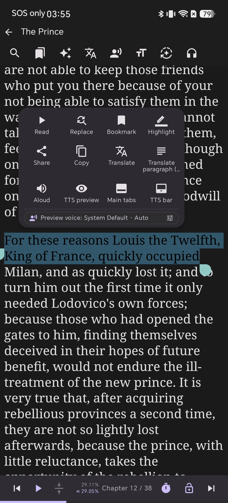
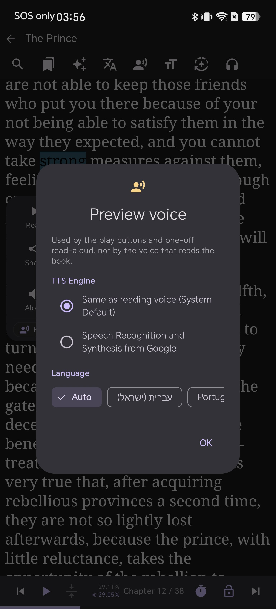

# Verifique a Pronúncia Frase por Frase: Leia Apenas o Texto Selecionado no Android com Shiori

Durante a leitura de um livro, é comum encontrar uma frase difícil de pronunciar — uma palavra desconhecida, um nome em outro idioma ou uma expressão com fonética inesperada. Iniciar a leitura em voz alta contínua do livro (TTS) apenas para ouvir esse trecho significa ter que escutar todo o restante da página, pausar e depois rolar a tela procurando onde você estava. Tudo o que você queria era ouvir *apenas aquela frase*, uma única vez.

O Shiori oferece uma função independente dedicada exatamente a isso: selecione qualquer palavra ou frase no leitor e ela será lida em voz alta uma única vez, sem iniciar a narração contínua do livro e sem mover sua posição de leitura.

## Por Que a Leitura Pontual é Tão Útil

* **Verificação de pronúncia no aprendizado de idiomas:** Ouça a pronúncia correta de uma palavra ou frase sem precisar reproduzir todo o capítulo.
* **Nomes e expressões estrangeiras no texto:** Livros frequentemente trazem termos em outras línguas — selecione apenas aquele trecho e ouça com a voz e o sotaque corretos.
* **Confirmação fonética antes de falar:** Ideal para leituras acadêmicas, apresentações ou práticas de conversação.

## O Que Você Precisa

* Shiori instalado no seu dispositivo Android (testado na versão v2.3.4)
* Qualquer livro aberto no leitor, com o texto visível na tela

Abaixo, a tela inicial de *O Príncipe* aberto no leitor do Shiori antes da seleção de texto:

## Passo 1 — Pressione e segure uma palavra para selecioná-la

Pressione e segure qualquer palavra no leitor por cerca de um segundo. A palavra será destacada, alças redondas aparecerão nas extremidades e um menu flutuante surgirá acima com opções como **Read**, **Bookmark**, **Highlight**, **Translate**, **Aloud** e **TTS preview**.

Se nada acontecer na primeira tentativa, segure por um instante a mais mantendo o dedo firme — um movimento antes do menu aparecer pode ser interpretado como gesto de passar página.

## Passo 2 — Arraste a alça para selecionar a frase completa

Selecionar apenas uma palavra é útil para consultas rápidas, mas para treinar a pronúncia o ideal é ouvir a frase inteira, captando o ritmo e a entonação natural. Arraste a alça redonda para cobrir todas as palavras desejadas.

O menu flutuante acompanha o movimento da seleção, permitindo verificar com clareza o trecho selecionado antes de iniciar a leitura.

## Passo 3 — Toque em Aloud para ouvir

Toque no botão **Aloud** no menu flutuante. O Shiori lerá o texto selecionado uma vez e parará imediatamente — sem continuar para a frase seguinte e sem abrir a barra de controle de reprodução do livro.

A seleção desaparece e você volta exatamente para onde estava — mesmo capítulo, mesma rolagem e mesmo progresso de leitura.

## Escolha a Voz e o Idioma da Leitura (Preview Voice)

A voz usada na opção **Aloud** não precisa ser a mesma voz que lê o livro inteiro. Toque no ícone de controles deslizantes ao lado de **Preview voice** na parte inferior do menu para abrir a janela de configuração.

A janela explica claramente: essa voz é "usada pelos botões de prévia e leitura pontual, não pela voz principal do livro". Você pode escolher outro motor de **TTS Engine** e definir o **Language** para um idioma específico em vez de Auto. Isso é essencial quando a frase selecionada está em uma língua diferente do restante da obra: escolha o idioma correspondente e a pronúncia soará natural e correta.

## Sem Alterar Sua Posição no Livro

O grande diferencial dessa ferramenta é a agilidade: ela utiliza o motor TTS para uma única frase e devolve o controle instantaneamente. Não há miniplayer para fechar nem necessidade de procurar onde você estava. Se a leitura do livro estava pausada, ela permanecerá pausada.

## Solução de Problemas (Troubleshooting)

* **Nada acontece ao tocar em Aloud:** Verifique se o seu dispositivo possui um motor TTS ativo nas configurações do sistema Android ou troque o **TTS Engine** na janela Preview voice.
* **O menu não abre ao pressionar e segurar:** Certifique-se de tocar no texto da página, evitando barras e margens, e mantenha o dedo imóvel.
* **A página rola ao puxar a alça:** Puxe diretamente pelo círculo da alça de seleção, e não pelo corpo do texto.
* **Leitura com sotaque ou idioma incorreto:** Abra **Preview voice** e selecione o **Language** manualmente em vez de Auto, confirmando se o pacote de voz está baixado.

## Dicas Úteis (Tips)

* **Selecione apenas uma palavra** quando precisar conferir um único termo sem precisar estender para a frase toda.
* **Configure vozes por idioma** em TTS Listening para reutilizar os mesmos perfis em Preview voice — consulte [Multi-Language Text-to-Speech in Shiori](/blog/multi-language-text-to-speech-android-epub/).
* **Menu multifuncional:** O mesmo menu gerencia marcadores, destaques coloridos e tradução instantânea — veja [Highlight and Take Notes in Shiori](/blog/highlight-and-take-notes-epub-android/) e [How to Translate to Multiple Languages](/blog/how-to-translate-to-multiple-language/).
* **Guia da tela do leitor:** Conheça todos os botões em [Every Button on the Reader Screen](/blog/epub-reader-screen-guide-android/).

## Uma Frase, Uma Vez

Você não precisa iniciar a leitura do livro inteiro apenas para conferir a pronúncia de uma linha. Selecione o texto, toque em **Aloud** e continue sua leitura tranquilamente.
